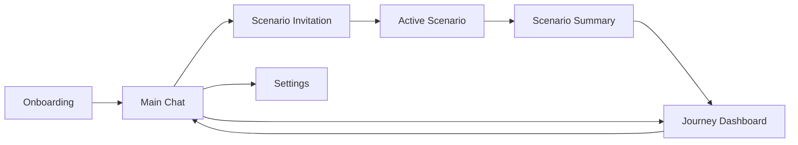
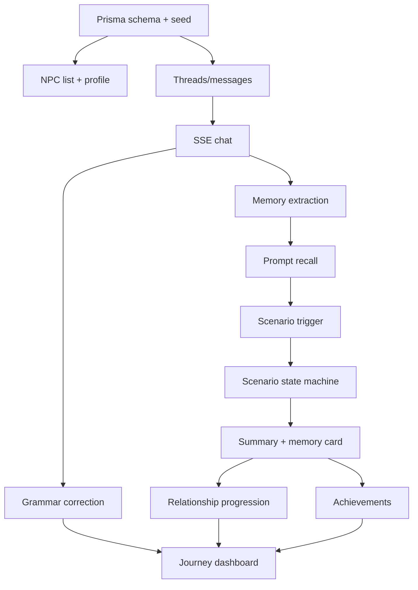

# Popcorn Language 产品立项 PRD（Product-Management 版）

> 版本：v1.0 · 日期：2026-06-04
> 作者：Rui Wu · 方法：`product-management:write-spec`
> 依据：`docs/context.md`、`README.md`、`docs/reports/architecture.md`、`docs/uat-sop.md`、`static-prototype/` 静态原型、`docs/prd-assets/` 原型截图
> 关系说明：本文是根目录 `prd.md`（`prd-skill` 版）的**平行补充版**，二者并存。`prd.md` 偏商业立项叙事（竞品、roadmap、甘特、风险）；本文偏 **write-spec 工程严谨度**——目标/非目标、标准用户故事、MoSCoW + Given/When/Then 验收、可量化先导/滞后指标、按负责人标注的开放问题，并反映**真实当前交付状态**。

---

## 0. 一页速览（TL;DR）

- **是什么**：基于本地 LLM 的中→英双语 AI 语言练习产品。学习者与会**记住自己**的 AI NPC 建立持续关系，在日常聊天中由 NPC **主动**埋下可练习的**嵌入式情景事件（scenario）**。
- **为什么**：现有 AI 语言学习产品把 AI 当作传统 gamification 的"附加工具"，且依赖云端专有模型。本项目验证：**本地开源 LLM 能否作为核心 engagement engine**，以 relationship-first + emergent scenario 的方式驱动持续练习。
- **给谁**：中文母语、CEFR A2–B2、想低压力练口语/书面表达的学习者；次要受众是 capstone 导师/评审（关注 memory architecture 等技术贡献）。
- **不是什么**：不是题库/背单词/课程流；不是商业上线产品（**local-demo only，永不部署到 localhost 之外**）；不做移动端、群聊、语音、严肃学习效果实验。
- **现状**：后端 W1–W9 完成、Web 客户端 W10 接通，225 Vitest 全绿，UAT SOP 15 用例就绪。本文用于**立项论证 + 后续迭代锚点**。

---

## 1. 需求背景（Problem Statement）

### 1.1 项目语境

Popcorn Language（产品名暂定 **Popcorn Social**）是 NUS Master of Computing 的 **CP5106 Computing Capstone**（单人开发、约 9–11 个有效开发周）。它是**工程 + 产品 demo**，不是商业产品，也不是 research paper。评估维度为 **Project Scope / Technical Contribution / Presentation & Writing**。

项目 spec 给定三条原始目标，均已收敛进本方案：
1. 将 AI 生成能力从 English-centric 扩展到**双语（中↔英）**；
2. 基于反馈**打磨用户旅程与界面**；
3. 用 **achievement / gameplay** 提升 **engagement and retention**（spec 原文重心是 engagement，不是教学效果）。

### 1.2 用户问题（谁，多痛，不解决的代价）

> **目标用户**：中文母语、想练英语表达但"开口/动笔有压力"的学习者。他们已经会刷题，但缺少**可持续、低压力、像真实社交**的练习对象。

四个具体痛点（均有竞品现状佐证，见 §4）：

| 痛点 | 用户体验表现 | 不解决的代价 |
|---|---|---|
| AI 像"附加工具" | 解释答案、单次 roleplay、课后反馈与主循环割裂 | 练习仍是"任务"，频率上不去 |
| 云端大模型成本/隐私不可控 | 个性化越强，API 成本与隐私风险越高 | 难以探索 local-first 个性化架构（也是 capstone 的技术贡献空间） |
| 长对话一致性弱 | NPC 忘记用户、人格漂移、上下文断裂 | 关系感崩塌，用户失去"被记住"的动机 |
| 练习场景像做题 | 进入 roleplay 有"切出去做作业"的割裂感 | gameplay 无法承接日常聊天的留存 |

### 1.3 产品假设（机会）

> 如果 AI NPC 能**记住用户**、**主动发起练习**，并把 scenario 结果**沉淀为关系、记忆与成就**，那么语言练习可以从"**任务驱动**"转为"**关系驱动**"的持续体验——且这一切能在**本地 7–9B 模型**的能力边界内稳定运行。

### 1.4 为什么是"本地 LLM"

本地部署（教授硬性要求）既是约束也是**技术贡献来源**：它带来隐私/成本/可控性优势，同时暴露延迟、JSON 稳定性、长程一致性等真实工程问题。本产品的设计主题正是"**顺着模型能力设计**"——用 bounded scenario、schema 校验、streaming UI、graceful degradation 把限制转化为架构论述。

---

## 2. 目标与非目标

### 2.1 目标（可度量的结果，而非产出）

**用户目标**
- **G1 降低开口门槛**：让中文母语用户以"和朋友聊天"的方式产生高频、低压力的英语输出（度量：onboarding 后首条消息率，§7）。
- **G2 练习自然发生**：让可结构化评估的练习从对话中**被 NPC 引出**，而非用户去菜单找题（度量：scenario accept / completion 率）。
- **G3 成长可见**：让每次练习沉淀为关系升级、记忆卡、成就、streak（度量：Journey 可见沉淀 + 关系进阶深度）。

**工程/capstone 目标**
- **G4 端到端可运行 demo**：Next.js 14 + Prisma/SQLite + Ollama，跑通 SSE chat、memory engine、scenario orchestrator、correction、achievements、settings、UAT。
- **G5 韧性**：Ollama 不可用时 app 仍可启动、非 AI 流程可用、聊天不卡死（graceful degradation）。
- **G6 可论证的技术贡献**：memory recall 多策略可切换且可对比（ablation），bounded scenario state machine 稳定。

### 2.2 非目标（明确不做 + 理由）

| 非目标 | 理由 |
|---|---|
| 移动端 / 双端 | 工程量超出单人 capstone budget；Web 已足够承载核心论点 |
| 生产级 authentication | 明确 local-demo；当前最小鉴权**不是项目贡献**，永不对外部署 |
| 语音 / 实时通话 / 口语评分 | 依赖额外模型与音频链路，分散对 memory/scenario 核心的投入 |
| 群聊 / 多 NPC 同场 | 对 persona 一致性与状态管理要求过高，偏离 relationship-first |
| 严肃学习效果对照实验 | 本项目是产品+工程 demo，不是教育学研究；成功判据不是"学习效果显著提升" |
| 超过 3 NPC / 2 scenario 的 MVP | 控 scope；深做一个 scenario 胜过铺三个 |
| 云同步 / 商业化 / 付费 | 与 local-first 定位冲突，且超出立项范围 |

---

## 3. 目标用户与画像

| Persona | 描述 | 核心诉求 | 在产品中的入口 |
|---|---|---|---|
| **P-A 初见者** | 第一次打开、对"AI 练习"将信将疑的中文母语学习者 | 快速理解"这不是背单词"，建立个性化画像 | Onboarding → Meet Lily |
| **P-B 日常练习者** | 想每天少量、低压力练表达 | 高频输出、即时但不打断的反馈、被记住 | Main Chat（Lily/Mr. Chen/Emma） |
| **P-C 目标驱动者** | 有具体场景目标（面试、租房、职场沟通） | 针对性 roleplay、清晰反馈与掌控感 | Scenario（Mock Interview / Flat Viewing） |
| **P-D 留存用户** | 已用一段时间，看重长期成长感 | 关系升级、streak、成就、记忆沉淀 | Journey Dashboard |
| **S-1 导师/评审**（次要 stakeholder） | capstone 评估者 | 验证技术贡献（memory architecture、韧性） | Settings（切 recall strategy）、health、ablation report |

---

## 4. 竞品分析

### 4.1 竞品与资料来源

| 竞品 | 类型 | 选择原因 |
|---|---|---|
| **Duolingo Max** | 大众化学习 + AI 功能层 | 代表"传统 gamification + AI feature layer" |
| **Langua / LanguaTalk** | AI conversation tutor | 代表 AI tutor / roleplay / feedback / memory 成熟方向 |
| **TalkPal** | AI tutor / roleplay | 代表多语言 AI tutor、个性化进度 |

来源：[Duolingo Max](https://blog.duolingo.com/duolingo-max/) · [Explain My Answer 免费化](https://blog.duolingo.com/explain-my-answer-now-free/) · [Langua](https://languatalk.com/ai-language-tutor) · [TalkPal](https://talkpal.co/) · [TalkPal Roleplays](https://talkpal.ai/roleplays/)

### 4.2 对比

| 维度 | Duolingo Max | Langua | TalkPal | **Popcorn Language** |
|---|---|---|---|---|
| 核心交互 | 课程路径、题目、Video Call、Roleplay | tutor 对话、roleplay、反馈、词汇 | tutor、多语言、roleplay | **NPC 社交聊天 + 嵌入式 scenario** |
| AI 定位 | 课程的增强功能 | AI 教师 | AI tutor | **关系型 NPC：既是朋友又是练习触发器** |
| 场景触发 | 课程/功能入口 | 用户选主题 | 用户选 tutor/roleplay | **NPC 基于聊天内容+关系主动邀请** |
| 记忆 | Video Call 中可记上次讨论 | 强调 smart memory | 强调记进度/弱项/难度 | **memory engine 为核心模块，recall strategy 可切换** |
| 部署 | 云端专有模型 | 云端 | 云端 | **本地 Ollama + SQLite，local-first** |
| 闭环 | XP / path / hub | 对话/反馈/flashcard | 进度/弱项 | **关系升级 + summary + AI memory + 成就 + Journey** |

### 4.3 启示与差异化（Parity vs Differentiation）

- **需达到 parity（基础能力，不是卖点）**：AI 对话练习、语法纠错、建议回复——竞品普遍具备，本产品必须有但不依赖它差异化。
- **差异化（Popcorn 的护城河论述）**：
  1. **Relationship-first**：练习对象是会记住你的 NPC，不是题库。
  2. **Scenario emerges from chat**：练习由 NPC 在合适时机自然提出，不是从菜单进入。
  3. **Local-first AI architecture**：把本地模型限制转化为工程设计主题（memory / bounded scenario / streaming / fallback）。
  4. **Memory as product surface**：记忆不是隐藏算法，而是 Journey 与 persona panel 中**可见**的成长证据。
- **差异化风险**：本地模型能力与延迟受限——通过 §9 的非功能约束与 §10 风险应对消化。

---

## 5. 用户故事（按 Persona 分组，标准格式）

> 格式：As a [具体用户], I want [能力], so that [价值]。按优先级排序，含边界/空态。

### 5.1 P-A 初见者
- **US-A1**（P0）As a 中文母语初学者, I want 在 onboarding 用身份/目标/兴趣建立画像, so that NPC 对话与 scenario 与我的真实生活相关。
- **US-A2**（P0）As a 害怕开口的初学者, I want 第一次就认识友好的 Lily 并被告知她会在聊天中自然提出练习, so that 我理解这是"和朋友聊"而非背单词。
- **US-A3**（P1）As a 老用户回访, I want 直接登录 demo 账号看到既有进度, so that 我无需重走 onboarding。

### 5.2 P-B 日常练习者
- **US-B1**（P0）As a 日常练习者, I want 用中文/英文/中英混合给 NPC 发消息并看到**流式**回复, so that 我能低压力高频输出。
- **US-B2**（P0）As a 日常练习者, I want 看到**嵌入式**语法纠错卡（可在 Settings 关闭）, so that 我即时知道更地道说法又不被打断。
- **US-B3**（P0）As a 日常练习者, I want 在 persona panel 看到 NPC 记住了我的哪些事实, so that 我感到被记住、愿意持续聊。
- **US-B4**（P0）As a 日常练习者, I want 切换 Lily（casual）/ Mr. Chen（professional）/ Emma（British）, so that 我能练不同语域。
- **US-B5**（P1）As a 日常练习者, I want 重新打开旧会话时加载历史消息, so that 对话有连续性。

### 5.3 P-C 目标驱动者
- **US-C1**（P0）As a 即将面试的学习者, I want 当我在聊天里透露"明天有英语面试"时由 Lily **主动邀请** mock interview, so that 练习自然发生而非去找题。
- **US-C2**（P0）As a scenario 参与者, I want 通过选择卡或自由输入应对，并看到 impression / stress / turns-left 的 HUD, so that 我有清晰反馈与掌控感。
- **US-C3**（P0）As a scenario 参与者, I want 收到邀请时能 accept 也能 decline / 稍后再说, so that 我保留控制权。
- **US-C4**（P0）As a scenario 完成者, I want 拿到 grade + 语言/语用/关系三类反馈, so that 我知道哪里好、哪里改。
- **US-C5**（P1）As a 内容尝鲜者, I want 至少有第二个 scenario（Flat Viewing）, so that 体验不止一种场景。

### 5.4 P-D 留存用户
- **US-D1**（P0）As a 持续使用者, I want 在 Journey 看到关系升级、streak、成就、AI 记忆卡, so that 每次练习都沉淀为可见旅程。
- **US-D2**（P0）As a 持续使用者, I want 解锁静态成就（First Chat / Scenario Survivor / Streak Week…）, so that 我有回来的动力。
- **US-D3**（P1）As a 追求独特感的用户, I want AI 根据我的行为**生成个性化成就**, so that 我的旅程是独一无二的。

### 5.5 S-1 导师/评审（stakeholder）
- **US-S1**（P1）As a 评审, I want 在 Settings 切换 memory recall strategy 并在 demo 看到差异, so that 我能评估 memory architecture 贡献。
- **US-S2**（P0）As a 评审, I want Ollama 关闭时 app 仍可启动、非 AI 流程可用, so that 我能验证 graceful degradation。

---

## 6. 产品原型与核心用户路径

> 原型来自 `static-prototype/`（CDN React，无构建，浏览器直开）与 `docs/prd-assets/` 截图。线上接通版见 `public/app/`（同源 served at `/app`）。

### 6.1 信息架构

### 6.2 核心页面

| 页面 | 目标 | 关键模块 |
|---|---|---|
| Onboarding | 建立心智、收集 profile | Welcome、role/goal/interests、Meet Lily |
| Main Chat | 日常练习主场 | NPC 列表、聊天流、纠错卡、persona/memory panel |
| Scenario | 从聊天自然进入练习 | Invitation、HUD、choice composer、summary |
| Journey | 展示长期成长沉淀 | relationships、scenarios、memories、achievements、streak |
| Settings | 控制本地模型与体验开关 | grammar correction、memory strategy、model、reset、health |

### 6.3 用户路径 1 — 首次进入与 Onboarding（US-A1/A2）
1. 看到主张："Practice English the way you'd practice life with friends."
2. 理解 local-first、中/英、CEFR A2–B2 范围。
3. 进入 profile：选身份、目标、兴趣。
4. 认识第一个 NPC Lily，并被告知她可能在聊天中主动提出 scenario。

### 6.4 用户路径 2 — 日常 NPC 聊天（US-B1~B4）
1. 进入 Main Chat，默认打开 Lily。
2. 左侧切换 Lily / Mr. Chen / Emma。
3. 发送中文/英文/中英混合消息。
4. NPC 以 persona 驱动回复，SSE token streaming 呈现。
5. 系统生成 grammar correction，作为嵌入式卡片出现。
6. 右侧 persona panel 展示 NPC 记住的用户事实与 AI memory。

### 6.5 用户路径 3 — NPC 主动触发 Scenario（US-C1/C3）
1. 用户透露情境，如"明天有英语面试"。
2. 系统按**关系等级 + 对话轮数 + topic match + cooldown** 判断是否可触发（规则化，不依赖 7B classifier）。
3. Lily 以普通消息形式提出 mock interview 邀请。
4. 用户可 accept，也可稍后再说，保留控制权。

### 6.6 用户路径 4 — Scenario 进行中（US-C2）
1. accept 后 Lily 切换为 roleplay 角色 Linda（HR）。
2. 仍是同一聊天布局，但背景/header/HUD/输入区**氛围升温**（"灯光变暗"而非"换房间"）。
3. HUD 展示 impression / stress / turns-left。
4. 用户用三张 choice cards 选策略，或自由输入。
5. 每轮由 JSON state machine 更新状态直至结束。

### 6.7 用户路径 5 — 结束与 Journey 沉淀（US-C4/D1）
1. scenario 结束生成 summary card。
2. summary 含 grade + language / pragmatics / relationship 三类反馈。
3. 系统生成新的 AI memory 卡。
4. 关系可能升级（如 Friend → Close friend）。
5. Journey 汇总 relationships / scenarios / memories / achievements / streak。

---

## 7. 功能需求与优先级（MoSCoW + Given/When/Then 验收）

> P0 = Must（无它不成 MVP）· P1 = Should（显著增值，可裁剪）· P2 = Could / Won't this time（延后）。
> 验收用 Given/When/Then，覆盖 happy path + 关键边界。

### 7.1 P0 — Must have

**F-01 Onboarding & 鉴权**（US-A1/A2/A3）
- Given 新用户在 onboarding 完成 wizard，When 提交 profile，Then 账号创建、`onboarding/complete` 标记、跳转 Main Chat。
- Given 已有 demo 账号，When 用 `demo`/`demo` 登录，Then 进入已 authed 状态、可见既有进度。

**F-02 NPC 系统**（US-B4）
- Given 已登录，When 打开 Main Chat，Then 列表显示 Lily / Mr. Chen / Emma，每行含关系等级、最近消息、persona。

**F-03 一对一聊天 + SSE streaming**（US-B1）
- Given 选中某 NPC，When 发送消息，Then 用户气泡立即出现（`user_message_saved`）、出现 typing 指示、NPC 回复 **token-by-token** 流式呈现、完成后 composer 重新可用。
- Given 重新打开会话，When 页面加载，Then 历史消息从 `GET /api/threads/:npcId/messages` 渲染（非空）。

**F-04 语法纠错**（US-B2）
- Given grammar correction 开启 且消息含语法错误，When NPC 回复时，Then 出现嵌入式 correction 卡；Given 在 Settings 关闭，Then 不再出现 correction。

**F-05 Memory Engine**（US-B3）
- Given 已抽取 memory facts，When 构造 prompt / 打开 persona panel，Then NPC 能引用记住的事实；recall strategy ∈ {recency, summary, semantic, hybrid} 可在 Settings 切换。

**F-06 Scenario 触发**（US-C1/C3）
- Given 关系等级 + 轮数 + topic + cooldown 满足规则，When 用户透露相关情境，Then NPC 以普通消息发起 invitation（`scenario_offer`），用户可 accept / decline。

**F-07 Scenario Gameplay**（US-C2/C4）
- Given invitation 被 accept，When 进入 active，Then 进入 roleplay、HUD 显示状态、每轮 choice/freetype 经 schema 校验更新 state，直到 `scenario_end`。
- Given scenario 结束，Then 生成含 grade + language/pragmatics/relationship 的 summary，并落库。

**F-08 Relationship 进阶**（US-D1）
- Given 聊天 / scenario 产生 relationshipPoints，When 跨过阈值，Then stage 在 acquaintance / friend / close 间转换并记录 event。

**F-09 Journey Dashboard**（US-D1）
- Given 已登录，When 打开 Journey，Then 展示 live 的 relationships / scenarios / memories / achievements / streak。

**F-10 静态成就**（US-D2）
- Given 满足规则（如首次聊天、完成首个 scenario、连续 7 天），When 触发，Then 解锁对应成就（First Chat / Scenario Survivor / Polite Mode / Streak Week 等）。

**F-11 Settings / System**（US-S2）
- Given 修改 grammar toggle / memory strategy / model，When 保存并刷新，Then 设置持久化；`GET /api/system/health` 正确反映 Ollama 可达性与模型。

**F-12 韧性 / Graceful degradation**（US-S2）
- Given Ollama 不可达，When 发送消息，Then 用户气泡仍保存、显示明确错误态、composer 重新可用、app 不崩溃、非 AI 页面可用。

**F-13 UAT**（质量门）
- Given UAT SOP 15 用例，When 执行，Then P0 核心用例无 Critical/High defect（详见 `docs/uat-sop.md`）。

### 7.2 P1 — Should have

| 功能 | 用户故事 | 验收要点 |
|---|---|---|
| Dynamic Achievements（LLM 生成个性化成就） | US-D3 | `POST /api/achievements/generate` 基于行为产出个性化成就并展示（已 W8 shipped） |
| 第二个 Scenario（Flat Viewing） | US-C5 | Emma 的 flat_viewing 可从 invitation → completed，验证 template 泛化 |
| 会话历史加载稳健性 | US-B5 | 大历史分页加载、空态友好 |
| Memory Ablation 可视化 | US-S1 | 不同 recall strategy 的对比可在 demo / `docs/reports/memory-ablation.md` 呈现 |

### 7.3 P2 — Could / Won't this time

| 功能 | 决策 | 理由 |
|---|---|---|
| Cross-NPC Memory Network | Could（架构预留） | 增强世界观，但需谨慎控制隐私/过度共享 |
| Reflective Companion（周期反思） | Could | Journey 中的 weekly reflection，时间允许再做 |
| Mobile / Voice-TTS / Group Chat | Won't this time | 见 §2.2 非目标 |
| Skill Tree / 排行榜 / 付费 / 部署 | Won't this time | 与 relationship-first + local-demo 定位冲突 |

---

## 8. 成功指标（先导 + 滞后，含目标值与口径）

> 本品非商业上线，指标为 **demo 验证阈值 + 假设**，测量来源主要是 `ActivityEvent`、UAT 记录与人工 demo 观察。

### 8.1 先导指标（天级，验证核心循环成立）

| 指标 | 定义 / 口径 | 目标（demo 阈值） | 测量来源 |
|---|---|---|---|
| First-message rate | onboarding 完成后发送首条消息的用户比例 | ≥ 90%（demo 流程必经） | UAT TC-01/05、activity events |
| Scenario accept rate | 收到 invitation 后选择 accept 的比例 | 假设 ≥ 50%（验证"主动邀请"被接受） | scenario session 状态流 |
| Scenario completion rate | accept 后走到 completed 的比例 | ≥ 80%（bounded 设计应高完成） | session lifecycle |
| Correction engagement | 含纠错的消息中用户后续修正/采纳比例 | 观察性，无硬目标 | message + correction |
| Error-recovery rate | Ollama 错误后 composer 恢复可用的比例 | 100%（韧性硬指标） | UAT TC-06/15 |

### 8.2 滞后指标（周级，验证留存与沉淀）

| 指标 | 定义 / 口径 | 目标 | 测量来源 |
|---|---|---|---|
| 多日 streak | 连续活跃天数（跨天口径待 §11 确认） | demo 中演示 ≥ 6–7 天闭环 | activity events / journey streak |
| 关系进阶深度 | 至少 1 个 NPC 到达 close 的用户比例 | demo 中可展示 acquaintance→friend→close 全链 | relationship events |
| Memory visibility（信任） | 用户能在 Journey/persona panel 看到记忆沉淀 | 定性达成（可见即合格） | persona panel / memory cards |
| 成就解锁广度 | 平均解锁成就数 / 是否出现 dynamic 成就 | demo 展示静态 + ≥1 dynamic | achievements |

> 评估窗口：以一次完整 demo / UAT pass 为单位评估，而非长期线上回收。

---

## 9. 非功能需求与技术约束（NFR）

### 9.1 技术栈

| 层 | 方案 |
|---|---|
| 前后端 | Next.js 14 App Router + TypeScript（API-only 后端，34 routes / 19 Prisma models） |
| UI | React 18 via CDN UMD + 浏览器内 Babel（**无构建**），`public/app/` 同源 served at `/app` |
| 数据库 | SQLite + Prisma |
| LLM | Ollama HTTP API；Chat = `qwen3.5:9b`（早期文档为 `qwen2.5:7b`），Embed = `nomic-embed-text` |
| 流式 | REST + SSE（POST 流，前端 `fetch` + ReadableStream 解析） |
| 测试 | Vitest（225 通过）+ headless web smoke（Playwright/Edge）+ manual UAT |

### 9.2 性能与可靠性

| 需求 | 标准 |
|---|---|
| 启动 | 无 Ollama 时 app 仍可启动，非 AI 页面可用 |
| Chat streaming | 用户消息立即出现；NPC 回复 token-by-token；**永不卡死** |
| CPU 延迟 | 9B 模型在 CPU 上回复慢属硬件预期，UI 以流式 + typing 指示消化（非缺陷） |
| 错误恢复 | Ollama 不可达 → 明确错误态 + composer 恢复 |
| JSON 稳定性 | scenario state 用 `format:"json"` + Zod schema + retry + fallback |
| 数据隔离 | 所有业务查询按 `userId` scoped；统一 `{error:{code,message}}` 错误信封 |

### 9.3 安全与隐私（含明确边界）

- **数据本地**：保存在本地 SQLite，PRD 范围不考虑云同步。
- **鉴权最小化（by design，非贡献、非安全发现）**：明文密码、单查询登录、`pop_uid` httpOnly cookie；**无 bcrypt / Auth.js / CSRF**。**仅限 localhost，永不对外部署**。demo seed 故意将 password=username。
- 上述最小鉴权、无构建 CDN/Babel、CPU 慢回复均为**刻意设计**，不应作为缺陷/安全发现登记（与 `docs/uat-sop.md` §13 一致）。

---

## 10. 开发计划

### 10.1 里程碑与**真实当前状态**

| 阶段 | 目标 | 主要交付 | 状态 |
|---|---|---|---|
| W1 Foundation | 骨架 / DB / seed / Ollama client | Next.js API、Prisma schema、3 NPC seed、health | ✅ 完成 |
| W2 Chat SSE | 主聊天跑通 | threads/messages API、SSE stream | ✅ 完成 |
| W3 Memory Engine | NPC 记住用户 | recent / summary / facts / recall strategy | ✅ 完成 |
| W4 Scenario v1 | Mock Interview 全流程 | trigger / invitation / accept / choices / summary | ✅ 完成 |
| W5 Progression | 关系/纠错/成就闭环 | relationship、grammar correction、static achievements | ✅ 完成 |
| W6 Journey & Settings | 产品闭环 | Journey dashboard、settings、system reset | ✅ 完成 |
| W7 Memory Eval | 记忆评测 | recall 策略 ablation 评测 | ✅ 完成 |
| W8 P1 Highlight | 技术亮点 | dynamic achievements、第二个 scenario（Flat Viewing） | ✅ 完成 |
| W9 Hardening / Demo / Report | 稳定性 + 演示 | error handling、offline Ollama、smoke:web、report figures | ✅ 完成 |
| W10 Web Client Wiring | 前后端联调 | `public/app/` 同源接通 live `/api`、qwen3.5:9b swap | ✅ 完成 |
| — UAT | 端到端验收 | `docs/uat-sop.md` 15 用例 | 🔄 进行中（本轮新增 SOP） |

> 当前 `main` 已合并 W10，225 Vitest 全绿、typecheck 干净。后续工作为执行 UAT 与可选 P1 深化。

### 10.2 阶段化策略

- **Phase 1（已交付）**：P0 核心循环 + 韧性 + 第一个 scenario → 可演示的端到端 demo。
- **Phase 2（进行/可选）**：UAT 执行收口；P1 深化（dynamic achievements 打磨、memory ablation 展示、第二 scenario 体验完善）。
- **Phase 3（capstone 收尾）**：Final report figures、demo 排练、known issues 收敛。

### 10.3 开发依赖

---

## 11. 开放问题（按负责人标注）

> 仅列从上下文**无法**自答、需对齐的问题。

| # | 问题 | 负责人 | 阻塞性 |
|---|---|---|---|
| Q1 | Technical contribution 边界：工程实现够，还是需带 small evaluation（memory ablation 是否已足够）? | 导师 | 非阻塞（影响 report 深度） |
| Q2 | 用什么 engagement metric **官方认定**"AI as engagement engine"成立? | 导师 / data | 非阻塞 |
| Q3 | 双语深度：architectural support 够，还是要完整中英对称内容? | 导师 | 非阻塞 |
| Q4 | streak / engagement 的精确口径（跨天定义、时区）? | data | 非阻塞 |
| Q5 | `messages-post` 等测试是否需注入 mock OllamaClient / fast-fail，以摆脱本地 Ollama 依赖? | eng | 非阻塞（影响 CI 确定性） |
| Q6 | `scenario_offer` 在 UI 上是否需更强的"NPC 主动"叙事，避免像系统弹窗? | design | 非阻塞 |

---

## 12. 风险与应对

| 风险 | 影响 | 应对 |
|---|---|---|
| 本地模型响应慢 | 用户等待焦虑 | SSE streaming、typing 指示、短 prompt、异步纠错 |
| JSON 输出不稳定 | scenario 状态机失败 | `format:"json"` + Zod schema + retry + fallback |
| NPC 人格漂移 | 社交真实感下降 | persona prompt + memory recall + recent buffer + summary |
| 记忆召回不准 | "被错误记住" | memory confidence、可删除 memory、recall strategy ablation |
| scenario 触发突兀 | 像系统弹窗，破坏关系感 | 由 NPC 消息发起、展示 rationale、允许 decline |
| scope 膨胀 | 单人开发超时 | P0 限定 3 NPC / 1–2 scenario / web only（见 §2.2） |

---

## 13. 立项结论

**建议立项**，以 **Web-based AI core + embedded gameplay** 为 MVP 主线。

立项价值在于：本产品不把 AI 当作传统学习流程的补丁，而是把 **AI NPC、记忆、关系、scenario、Journey 设计成同一个闭环**；工程上，本地 LLM 的限制不是副作用，而是技术贡献来源——通过 **memory architecture、bounded scenario state machine、streaming UI、graceful degradation** 验证 local-first AI language learning 的可行性。

MVP 成功判据不是"语言学习效果显著提升"，而是：
1. 用户能否**持续**和 NPC 对话；
2. scenario 能否**自然**从聊天中出现并完成；
3. 记忆/关系/成就是否让一次次练习**沉淀为可见旅程**；
4. 本地 LLM 架构能否在**可控范围**内支撑端到端体验。

> **后续可产出物（按需）**：design brief、engineering ticket 拆分、stakeholder pitch、导师对齐用 one-pager。
