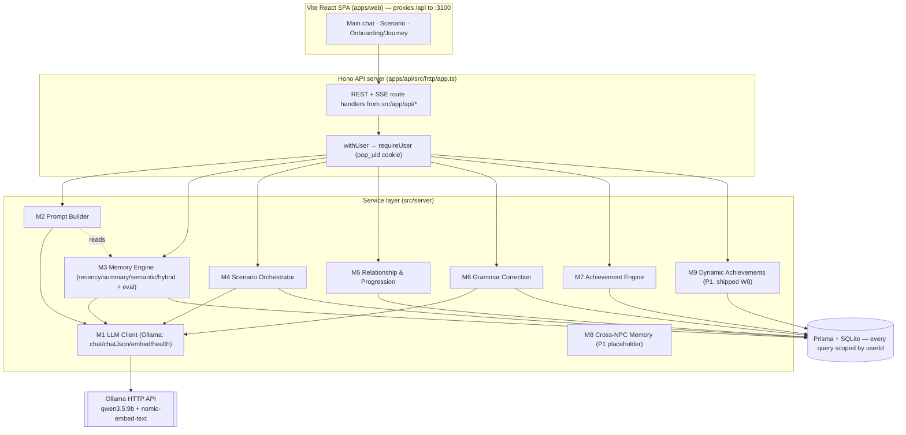
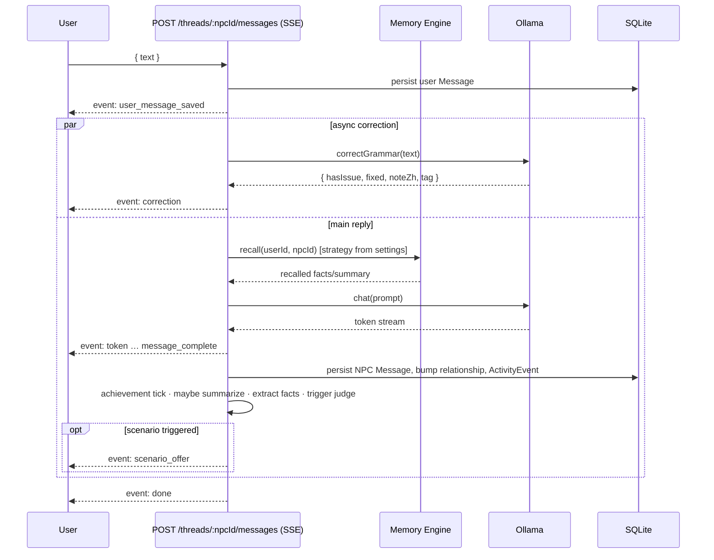
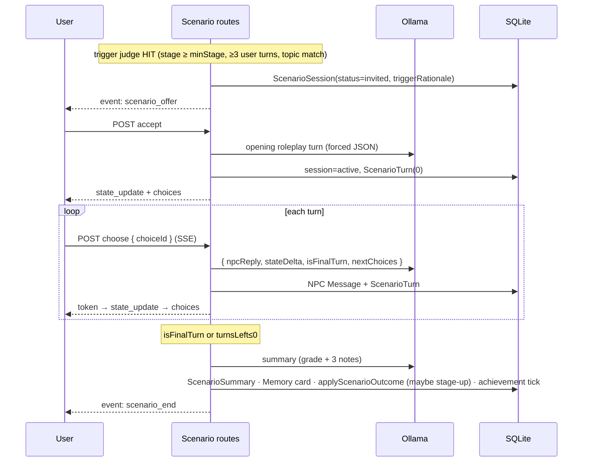

# Architecture & Data-Flow Diagrams

> For the Final Report. Mermaid renders natively on GitHub. Source of truth for module
> responsibilities is the v2 spec (`docs/superpowers/specs/2026-05-25-backend-roadmap-design.md`).

## Module architecture

## Workflow A — ordinary chat message

## Workflow B — scenario trigger → completion

