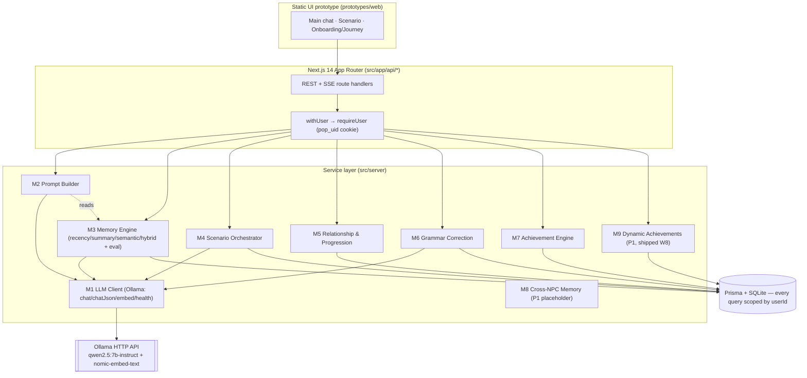
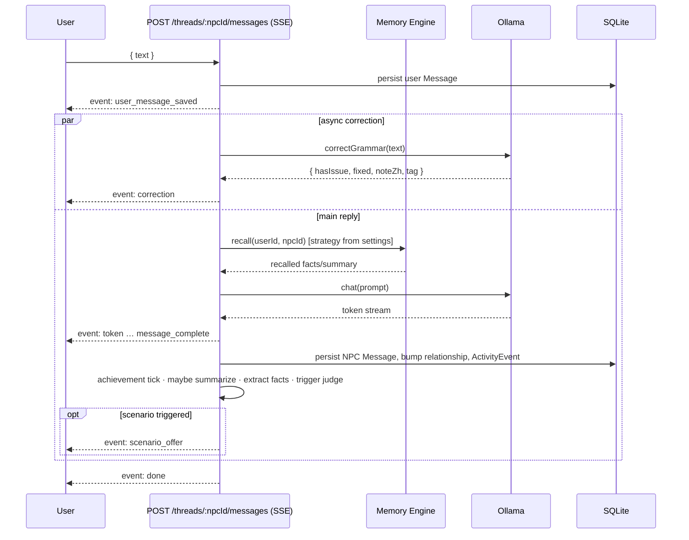
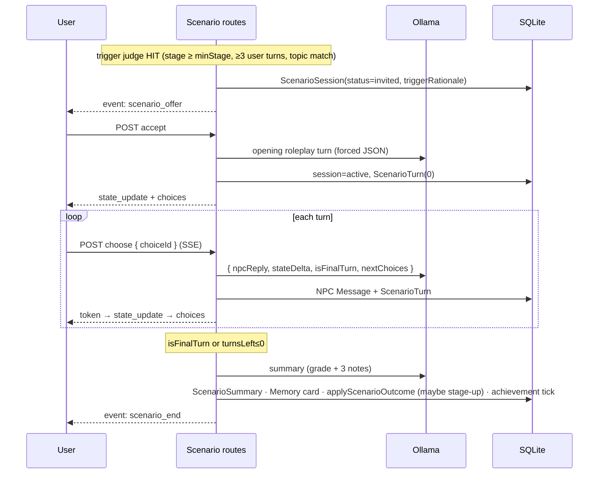

# W9 — Hardening, Demo Prep, Report Figures Implementation Plan

> **For agentic workers:** REQUIRED SUB-SKILL: Use superpowers:subagent-driven-development (recommended) or superpowers:executing-plans to implement this plan task-by-task. Steps use checkbox (`- [ ]`) syntax for tracking.

**Goal:** Make the feature-complete W1–W8 backend clone-run-demo-able and report-citable — accurate docs, a deterministic memory-ablation figure, architecture diagrams, a rich one-command demo seed, and a light hardening audit — **without changing any runtime behaviour W1–W8 locked in.**

**Architecture:** Four workstreams on one branch. *Code* deliverables (ablation regenerator, demo seed, the one validation fix, the smoke test) are TDD'd; *artifact* deliverables (README, `docs/backend.md` banner, ablation `.md`, Mermaid diagrams) are verified by review + `npm run db:seed` / `db:seed:demo` / `typecheck` / `test`, not by hollow unit tests.

**Tech Stack:** Next.js 14 App Router, TypeScript, Prisma + SQLite, Zod, Vitest (`@`→`./src`, `tests/**/*.test.ts`, `fileParallelism:false`), tsx (relative imports only — does not resolve `@/`).

**Design:** `docs/superpowers/specs/2026-05-29-backend-w9-hardening-demo-report-design.md`

**Scope guards (do NOT violate):**
- **Auth is intentionally minimal** (plaintext password, single-query login, `pop_uid=userId` cookie, no bcrypt/Auth.js/CSRF). Local-demo-only **by design**; not a contribution; **never a security finding**. W9 only *documents* it more prominently.
- **Error envelope** (`{ error: { code, message } }`) is already uniform — **do not churn response shapes**.
- **No new product features**, no new routes (the demo seed is a script, not a route).
- **No live-Ollama dependency** in tests or in the committed figures.

---

## Task 1: Pin the dev server to port 3100

Port 3000 is OS-blocked on the dev machine; the project has always had to run `next dev -p 3100` manually. Pin it. (README's run section is rewritten in Task 9, which will use `:3100`.)

**Files:**
- Modify: `package.json` (the `dev` script)

- [ ] **Step 1: Change the dev script**

In `package.json`, change:
```json
    "dev": "next dev",
```
to:
```json
    "dev": "next dev -p 3100",
```

- [ ] **Step 2: Verify typecheck still clean (no code touched, sanity only)**

Run: `npm run typecheck`
Expected: exit 0.

- [ ] **Step 3: Commit**

```bash
git -c core.autocrlf=false add package.json
git -c core.autocrlf=false commit -m "chore: pin dev server to port 3100 (3000 is OS-blocked locally)"
```

---

## Task 2: Extract the deterministic fixture embedder (shared by harness test + ablation generator)

The W7 harness test embeds the fixture corpus with an inline deterministic topic-classifier mock. The ablation generator (Task 4) needs the *same* embedder. Extract it to one module so both share it (DRY), and refactor the existing test to import it.

**Files:**
- Create: `src/server/memory/eval/fixtureEmbed.ts`
- Modify: `tests/integration/memory-eval-harness.test.ts` (replace the inline mock with an import)

- [ ] **Step 1: Create the shared embedder**

`src/server/memory/eval/fixtureEmbed.ts`:
```ts
// src/server/memory/eval/fixtureEmbed.ts
import type { OllamaClient } from '@/server/llm/ollama';

// Deterministic topic-classifier embedding for the ablation fixture: each text maps to one
// orthogonal basis vector, so cosine cleanly ranks the topically-matching corpus item first.
// Priority order matters (the summary text mentions both "hiking" and "cat" — hiking wins).
const E = {
  hobby: [1, 0, 0, 0, 0],
  pet: [0, 1, 0, 0, 0],
  job: [0, 0, 1, 0, 0],
  food: [0, 0, 0, 1, 0],
  other: [0, 0, 0, 0, 1],
};
const TOPICS: { vec: number[]; words: string[] }[] = [
  { vec: E.hobby, words: ['hiking', 'outdoor', 'weekend'] },
  { vec: E.pet, words: ['pet', 'cat'] },
  { vec: E.job, words: ['work', 'job', 'engineer'] },
  { vec: E.food, words: ['spicy', 'food', 'dish'] },
];

export async function fixtureEmbed(text: string): Promise<number[]> {
  const t = text.toLowerCase();
  for (const top of TOPICS) if (top.words.some((w) => t.includes(w))) return top.vec;
  return E.other;
}

// Shape the harness expects (Pick<OllamaClient, 'embed'>).
export const fixtureOllama: Pick<OllamaClient, 'embed'> = { embed: fixtureEmbed };
```

- [ ] **Step 2: Refactor the harness test to import it**

In `tests/integration/memory-eval-harness.test.ts`, delete the inline `E` / `TOPICS` / `ollamaMock` block (the comment + `const E = {...}` through `const ollamaMock = {...};`) and add the import near the top:
```ts
import { fixtureOllama } from '@/server/memory/eval/fixtureEmbed';
```
Then replace the one usage `runMemoryEval(prisma, ollamaMock, caller.id, { k: 3 })` with `runMemoryEval(prisma, fixtureOllama, caller.id, { k: 3 })`.

- [ ] **Step 3: Run the harness test to verify identical behaviour**

Run: `npm run test -- memory-eval-harness`
Expected: PASS (same assertions — semantic recall = 1, hybrid ≥ recency, 16 logs, eval user cleaned up).

- [ ] **Step 4: Typecheck**

Run: `npm run typecheck`
Expected: exit 0.

- [ ] **Step 5: Commit**

```bash
git -c core.autocrlf=false add src/server/memory/eval/fixtureEmbed.ts tests/integration/memory-eval-harness.test.ts
git -c core.autocrlf=false commit -m "refactor: extract deterministic fixture embedder for reuse by the ablation generator"
```

---

## Task 3: `renderAblationReport` — the report renderer (pure, TDD'd)

A pure function that turns a `MemoryEvalResult` into the full `memory-ablation.md` document. **The committed table shows recall@k only** (fully deterministic across runs); latency and token cost are non-deterministic for the in-memory fixture, so they are deferred to the documented live-run command — keeping the committed artifact byte-stable.

**Files:**
- Create: `src/server/memory/eval/report.ts`
- Test: `tests/unit/ablation-report.test.ts`

- [ ] **Step 1: Write the failing test**

`tests/unit/ablation-report.test.ts`:
```ts
// tests/unit/ablation-report.test.ts
import { describe, it, expect } from 'vitest';
import { renderAblationReport } from '@/server/memory/eval/report';
import type { MemoryEvalResult } from '@/server/memory/eval/harness';

const fake: MemoryEvalResult = {
  datasetId: 'default',
  k: 3,
  perStrategy: [
    { name: 'recency', recallAtK: 0.125, latencyMs: 0, tokenCost: 5 },
    { name: 'summary', recallAtK: 0.625, latencyMs: 0, tokenCost: 7 },
    { name: 'semantic', recallAtK: 1, latencyMs: 1, tokenCost: 6 },
    { name: 'hybrid', recallAtK: 1, latencyMs: 0, tokenCost: 6 },
  ],
};

describe('renderAblationReport', () => {
  it('renders a deterministic recall@k table + interpretation + live-run command', () => {
    const md = renderAblationReport(fake);
    expect(md).toContain('# Memory-Strategy Ablation');
    expect(md).toContain('recall@3');
    // one row per strategy, recall@k value present
    expect(md).toContain('| recency | 0.125 |');
    expect(md).toContain('| summary | 0.625 |');
    expect(md).toContain('| semantic | 1 |');
    expect(md).toContain('| hybrid | 1 |');
    // live-run command for real latency/token cost
    expect(md).toContain('/api/dev/memory-eval');
    expect(md).toContain(':3100');
    // latency/token columns are NOT in the committed table (non-deterministic for the fixture)
    expect(md).not.toContain('Latency (ms)');
    expect(md).not.toContain('Token cost');
  });

  it('is byte-identical across calls (deterministic)', () => {
    expect(renderAblationReport(fake)).toBe(renderAblationReport(fake));
  });
});
```

- [ ] **Step 2: Run it to verify it fails**

Run: `npm run test -- ablation-report`
Expected: FAIL — `renderAblationReport` not exported / module missing.

- [ ] **Step 3: Implement `renderAblationReport`**

`src/server/memory/eval/report.ts`:
```ts
// src/server/memory/eval/report.ts
import type { MemoryEvalResult } from './harness';

// Renders the canonical, deterministic ablation document. Only recall@k is committed (it is
// stable across runs); latency and token cost depend on the in-memory mock embedder and the
// host, so they are obtained from the documented live run rather than committed.
export function renderAblationReport(result: MemoryEvalResult): string {
  const k = result.k;
  const header = `| Strategy | recall@${k} |\n|---|---|`;
  const rows = result.perStrategy.map((s) => `| ${s.name} | ${s.recallAtK} |`).join('\n');
  const get = (n: string) => result.perStrategy.find((s) => s.name === n);
  const recency = get('recency')?.recallAtK ?? 0;
  const semantic = get('semantic')?.recallAtK ?? 0;
  const summary = get('summary')?.recallAtK ?? 0;

  return `# Memory-Strategy Ablation (W7 Harness)

> Generated deterministically by \`npm run report:ablation\` from the fixed eval corpus
> (\`dataset: ${result.datasetId}\`, k=${k}, 4 strategies × 4 probes) using an in-memory
> topic-classifier embedder — **no Ollama required, byte-stable across runs.**

${header}
${rows}

**Reading.** On a corpus where the topical facts sit *outside* the recency window, the recency
baseline recovers only ${recency} of the relevant items, the summary strategy ${summary}, while
the semantic and hybrid strategies recover all of them (${semantic}). This is the ablation result
cited in the report's memory chapter: embedding-based recall closes the gap that a pure
recency buffer leaves open.

> **Latency and token cost are intentionally omitted above** — the fixture uses a sub-millisecond
> mock embedder, so those numbers are not representative and not deterministic. To capture real
> latency/token cost against a live model, run the dev server (\`npm run dev\`) with Ollama up and
> call the dev-only eval endpoint:
>
> \`\`\`
> curl -s -X POST http://localhost:3100/api/dev/memory-eval \\
>   -H 'content-type: application/json' \\
>   -b 'pop_uid=<your-user-id>' -d '{"k":3}' | jq .perStrategy
> \`\`\`
>
> The endpoint returns \`{ datasetId, k, perStrategy: [{ name, recallAtK, latencyMs, tokenCost }] }\`
> and writes one \`MemoryRetrievalLog\` per (strategy × probe) for the caller.
`;
}
```

- [ ] **Step 4: Run the test to verify it passes**

Run: `npm run test -- ablation-report`
Expected: PASS (both cases).

- [ ] **Step 5: Typecheck + commit**

```bash
npm run typecheck
git -c core.autocrlf=false add src/server/memory/eval/report.ts tests/unit/ablation-report.test.ts
git -c core.autocrlf=false commit -m "feat: renderAblationReport — deterministic recall@k report (W9 report figures)"
```

---

## Task 4: Ablation generator test that writes the committed report

A vitest integration test runs the **real four strategies** over the fixture (via `runMemoryEval` + `fixtureOllama`), renders the report, **writes it to `docs/reports/memory-ablation.md`**, and asserts the research ordering. Because recall@k is deterministic, re-running produces byte-identical output (no spurious git diffs). A `report:ablation` npm script runs just this test on demand.

**Files:**
- Create: `tests/integration/ablation-report.test.ts`
- Modify: `package.json` (add `report:ablation` script)
- Generated artifact (committed): `docs/reports/memory-ablation.md`

- [ ] **Step 1: Write the generator test**

`tests/integration/ablation-report.test.ts`:
```ts
// tests/integration/ablation-report.test.ts
// Regenerates the committed memory-ablation figure AND asserts the research ordering.
// Deterministic: recall@k is stable, so the written file is byte-identical run-to-run.
import { describe, it, expect, afterAll } from 'vitest';
import { mkdirSync, writeFileSync, readFileSync } from 'node:fs';
import { resolve } from 'node:path';
import { PrismaClient } from '@prisma/client';
import { runMemoryEval } from '@/server/memory/eval/harness';
import { renderAblationReport } from '@/server/memory/eval/report';
import { fixtureOllama } from '@/server/memory/eval/fixtureEmbed';

const prisma = new PrismaClient();
const CALLER = '__w9_ablation_gen__';

afterAll(async () => {
  await prisma.user.deleteMany({ where: { username: CALLER } });
  await prisma.user.deleteMany({ where: { username: { startsWith: '__memeval__' } } });
  await prisma.$disconnect();
});

describe('ablation report generator', () => {
  it('runs the four strategies on the fixture, writes the figure, and locks the ordering', async () => {
    const caller = await prisma.user.create({ data: { username: CALLER, password: 'pw' } });
    const result = await runMemoryEval(prisma, fixtureOllama, caller.id, { k: 3 });

    // Research hypothesis (deterministic on this fixture).
    const get = (n: string) => result.perStrategy.find((s) => s.name === n)!;
    expect(get('semantic').recallAtK).toBe(1);
    expect(get('hybrid').recallAtK).toBeGreaterThanOrEqual(get('recency').recallAtK);
    expect(get('semantic').recallAtK).toBeGreaterThan(get('recency').recallAtK);

    const md = renderAblationReport(result);
    const dir = resolve(process.cwd(), 'docs/reports');
    mkdirSync(dir, { recursive: true });
    writeFileSync(resolve(dir, 'memory-ablation.md'), md, 'utf8');

    const written = readFileSync(resolve(dir, 'memory-ablation.md'), 'utf8');
    expect(written).toContain('# Memory-Strategy Ablation');
    expect(written).toContain('| semantic | 1 |');

    // caller-owned logs cleaned up (figure run leaves no residue)
    await prisma.memoryRetrievalLog.deleteMany({ where: { userId: caller.id } });
  });
});
```

- [ ] **Step 2: Run it — it writes the file and passes**

Run: `npm run test -- ablation-report.test`
Expected: PASS; `docs/reports/memory-ablation.md` now exists.

- [ ] **Step 3: Add the convenience script**

In `package.json` scripts, add:
```json
    "report:ablation": "vitest run ablation-report",
```

- [ ] **Step 4: Eyeball the generated file**

Run: `npm run report:ablation`
Then open `docs/reports/memory-ablation.md` and confirm the table reads `recency 0.125 / summary 0.625 / semantic 1 / hybrid 1` and the live-run box is present.

- [ ] **Step 5: Commit (test + script + generated figure together)**

```bash
git -c core.autocrlf=false add tests/integration/ablation-report.test.ts package.json docs/reports/memory-ablation.md
git -c core.autocrlf=false commit -m "feat: committed memory-ablation figure + deterministic regenerator (npm run report:ablation)"
```

---

## Task 5: Architecture + data-flow diagrams (Mermaid)

Hand-authored Mermaid diagrams for direct paste into the report: a module/architecture diagram and the two key sequence flows (chat, scenario), lifted from the spec's ASCII. Artifact task — verified by review (Mermaid renders on GitHub).

**Files:**
- Create: `docs/reports/architecture.md`

- [ ] **Step 1: Write the diagrams file**

`docs/reports/architecture.md`:
````markdown
# Architecture & Data-Flow Diagrams

> For the Final Report. Mermaid renders natively on GitHub. Source of truth for module
> responsibilities is the v2 spec (`docs/superpowers/specs/2026-05-25-backend-roadmap-design.md`).

## Module architecture



## Workflow A — ordinary chat message



## Workflow B — scenario trigger → completion


````

- [ ] **Step 2: Review render**

Open `docs/reports/architecture.md` on GitHub or a Mermaid preview; confirm all three diagrams parse (no syntax errors).

- [ ] **Step 3: Commit**

```bash
git -c core.autocrlf=false add docs/reports/architecture.md
git -c core.autocrlf=false commit -m "docs: architecture + chat/scenario sequence diagrams (W9 report figures)"
```

---

## Task 6: Demo seed — one command for a rich, live-looking learner

An **additive, idempotent** seed creating a `demo`/`demo` user with relationships at varied stages, memory facts + a card, one completed graded scenario, unlocked achievements, and a multi-day activity history. The base seed (`npm run db:seed`) must have run first (NPC/template/achievement defs). Logic lives in an importable `seedDemo()` (relative imports only, so both `tsx` and vitest can load it); a thin runner wraps it.

**Files:**
- Create: `prisma/seedDemo.ts` (importable logic)
- Create: `prisma/seed-demo.ts` (runner)
- Modify: `package.json` (add `db:seed:demo`)
- Test: `tests/integration/seed-demo.test.ts`

- [ ] **Step 1: Write the failing test**

`tests/integration/seed-demo.test.ts`:
```ts
// tests/integration/seed-demo.test.ts
import { describe, it, expect, afterAll } from 'vitest';
import { PrismaClient } from '@prisma/client';
import { seedDemo } from '../../prisma/seedDemo';
import { GET as journeySummary } from '@/app/api/journey/summary/route';
import { SESSION_COOKIE } from '@/server/auth/session';

const prisma = new PrismaClient();
const U = '__w9_demo_test__';

afterAll(async () => {
  await prisma.user.deleteMany({ where: { username: U } });
  await prisma.$disconnect();
});

describe('seedDemo', () => {
  it('creates a rich, idempotent demo user the real read paths see as non-empty', async () => {
    // run twice to prove idempotency (no unique-constraint crash, stable counts)
    await seedDemo(prisma, { username: U });
    const { userId } = await seedDemo(prisma, { username: U });

    const user = await prisma.user.findFirstOrThrow({ where: { username: U }, include: { profile: true, settings: true } });
    expect(user.id).toBe(userId);
    expect(user.profile).not.toBeNull();
    expect(user.settings?.memoryStrategy).toBe('hybrid');

    const rels = await prisma.relationship.findMany({ where: { userId }, orderBy: { stageValue: 'desc' } });
    expect(rels.map((r) => r.stageValue)).toEqual([3, 2, 1]); // close / friend / acquaintance

    expect(await prisma.memoryFact.count({ where: { userId } })).toBeGreaterThanOrEqual(4);
    expect(await prisma.memory.count({ where: { userId } })).toBeGreaterThanOrEqual(1);

    const completed = await prisma.scenarioSession.findFirstOrThrow({ where: { userId, status: 'completed' }, include: { summary: true } });
    expect(completed.summary?.grade).toBeTruthy();

    expect(await prisma.userAchievement.count({ where: { userId } })).toBeGreaterThanOrEqual(3);
    expect(await prisma.activityEvent.count({ where: { userId } })).toBeGreaterThanOrEqual(6);

    // the real journey endpoint reads it back as non-empty
    const req = new Request('http://x/', { headers: { cookie: `${SESSION_COOKIE}=${userId}` } });
    const body = await (await journeySummary(req)).json();
    expect(body.conversations).toBeGreaterThan(0);
    expect(body.scenarios).toBeGreaterThanOrEqual(1);
    expect(body.memories).toBeGreaterThanOrEqual(1);
  });
});
```

- [ ] **Step 2: Run it to verify it fails**

Run: `npm run test -- seed-demo`
Expected: FAIL — `seedDemo` module missing.

- [ ] **Step 3: Implement the importable seeder**

`prisma/seedDemo.ts`:
```ts
// prisma/seedDemo.ts — additive, idempotent demo data (run AFTER `npm run db:seed`).
import type { PrismaClient } from '@prisma/client';

const DAY = 86_400_000;

export async function seedDemo(
  prisma: PrismaClient,
  opts: { username?: string } = {},
): Promise<{ userId: string }> {
  const username = opts.username ?? 'demo';

  // idempotent: drop any prior demo user; cascade clears all owned rows.
  await prisma.user.deleteMany({ where: { username } });

  const lily = await prisma.npc.findUnique({ where: { id: 'lily' } });
  if (!lily) throw new Error('Base seed missing — run `npm run db:seed` before `db:seed:demo`.');

  const now = Date.now();
  const user = await prisma.user.create({
    data: {
      username,
      password: username,
      displayName: 'Demo Learner',
      profile: { create: { role: 'Software engineer', goal: 'work', interests: JSON.stringify(['coffee', 'hiking', 'cats']) } },
      settings: { create: { memoryStrategy: 'hybrid', grammarCorrection: true } },
    },
  });

  const stages: { npcId: string; stage: string; stageValue: number }[] = [
    { npcId: 'lily', stage: 'close', stageValue: 3 },
    { npcId: 'chen', stage: 'friend', stageValue: 2 },
    { npcId: 'emma', stage: 'acquaintance', stageValue: 1 },
  ];
  let lilyThreadId = '';
  for (const { npcId, stage, stageValue } of stages) {
    const rel = await prisma.relationship.create({
      data: {
        userId: user.id, npcId, stage, stageValue,
        relationshipPoints: stageValue * 20,
        conversationCount: stageValue * 4,
        scenarioCount: npcId === 'lily' ? 1 : 0,
        lastInteractionAt: new Date(now - DAY),
      },
    });
    if (stageValue >= 2) {
      await prisma.relationshipEvent.create({ data: { relationshipId: rel.id, fromStage: 'acquaintance', toStage: 'friend', reason: 'msg_count_threshold' } });
    }
    if (stageValue >= 3) {
      await prisma.relationshipEvent.create({ data: { relationshipId: rel.id, fromStage: 'friend', toStage: 'close', reason: 'scenario_completed:Mock Interview' } });
    }
    const thread = await prisma.thread.create({ data: { userId: user.id, npcId, lastMsgAt: new Date(now - DAY) } });
    if (npcId === 'lily') lilyThreadId = thread.id;
    await prisma.message.create({ data: { threadId: thread.id, userId: user.id, role: 'user', text: 'Hi! Good to see you again.', createdAt: new Date(now - DAY - 3_600_000) } });
    await prisma.message.create({ data: { threadId: thread.id, userId: null, role: 'npc', text: 'Hey! Always good to chat with you.', createdAt: new Date(now - DAY) } });
  }

  const facts: [string, string][] = [
    ['has_pet', 'cat'],
    ['works_as', 'software engineer'],
    ['likes', 'hiking'],
    ['lives_near', 'Clementi'],
  ];
  for (const [predicate, value] of facts) {
    await prisma.memoryFact.create({ data: { userId: user.id, predicate, value, knownToNpcs: JSON.stringify(['lily', 'chen', 'emma']) } });
  }
  await prisma.memory.create({
    data: { userId: user.id, title: 'Cat-loving hiker', body: 'You often bring up weekend hikes and your cat — a warm, outdoorsy vibe.', npcId: 'lily', sourceType: 'chat_pattern' },
  });

  // one completed, graded scenario with Lily (mock_interview)
  const session = await prisma.scenarioSession.create({
    data: {
      userId: user.id, npcId: 'lily', threadId: lilyThreadId, templateId: 'mock_interview',
      status: 'completed', state: JSON.stringify({ impression: 8, stress: 'Low', turnsLeft: 0 }),
      startedAt: new Date(now - DAY - 1_800_000), endedAt: new Date(now - DAY - 600_000),
    },
  });
  await prisma.scenarioSummary.create({
    data: {
      sessionId: session.id, grade: 'A-',
      languageNote: 'Strong, polite phrasing; a couple of article slips.',
      pragmaticsNote: 'Good hedging and turn-taking under light pressure.',
      relationshipNote: 'Lily was impressed — your rapport moved to close friend.',
    },
  });
  await prisma.scenarioTurn.create({
    data: { sessionId: session.id, turnIndex: 0, stateBefore: JSON.stringify({ impression: 5, stress: 'Medium', turnsLeft: 6 }), stateAfter: JSON.stringify({ impression: 6, stress: 'Medium', turnsLeft: 5 }) },
  });

  for (const achievementId of ['first_chat', 'scenario_survivor', 'polite_mode']) {
    await prisma.userAchievement.create({ data: { userId: user.id, achievementId } });
  }

  for (let d = 0; d < 6; d++) {
    await prisma.activityEvent.create({ data: { userId: user.id, type: 'message_sent', createdAt: new Date(now - d * DAY) } });
  }
  await prisma.activityEvent.create({ data: { userId: user.id, type: 'scenario_completed', createdAt: new Date(now - DAY - 600_000) } });

  return { userId: user.id };
}
```

- [ ] **Step 4: Run the test to verify it passes**

Run: `npm run test -- seed-demo`
Expected: PASS.

- [ ] **Step 5: Add the runner + npm script**

`prisma/seed-demo.ts`:
```ts
// prisma/seed-demo.ts — `npm run db:seed:demo` entrypoint.
import { PrismaClient } from '@prisma/client';
import { seedDemo } from './seedDemo';

const prisma = new PrismaClient();
seedDemo(prisma)
  .then(({ userId }) => console.log(`Seeded demo user "demo" (password "demo") — id ${userId}.`))
  .catch((e) => { console.error(e); process.exit(1); })
  .finally(() => prisma.$disconnect());
```

In `package.json` scripts, add:
```json
    "db:seed:demo": "tsx prisma/seed-demo.ts",
```

- [ ] **Step 6: Run the real seed end-to-end against dev.db**

Run: `npm run db:seed` then `npm run db:seed:demo`
Expected: prints `Seeded demo user "demo" (password "demo") — id …`. Re-run `npm run db:seed:demo` once more — it must succeed again (idempotent), not crash on a unique constraint.

- [ ] **Step 7: Typecheck + commit**

```bash
npm run typecheck
git -c core.autocrlf=false add prisma/seedDemo.ts prisma/seed-demo.ts package.json tests/integration/seed-demo.test.ts
git -c core.autocrlf=false commit -m "feat: db:seed:demo — rich, idempotent demo learner for live demos (W9)"
```

---

## Task 7: Hardening — Zod-validate the lone unvalidated body route

Audit result: `withUser` coverage is complete and every body-parsing route uses Zod + `.catch()` **except** `scenarios/sessions/[id]/decline`, which casts `req.json()`. Bring it in line (consistency hardening only; `reason` stays optional, so all current valid calls keep working — only a non-object body now returns the standard `400`).

**Files:**
- Modify: `src/app/api/scenarios/sessions/[id]/decline/route.ts`
- Test: `tests/integration/scenario-decline-validation.test.ts`

- [ ] **Step 1: Write the failing test**

`tests/integration/scenario-decline-validation.test.ts`:
```ts
// tests/integration/scenario-decline-validation.test.ts
import { describe, it, expect, afterAll } from 'vitest';
import { PrismaClient } from '@prisma/client';
import { POST as decline } from '@/app/api/scenarios/sessions/[id]/decline/route';
import { SESSION_COOKIE } from '@/server/auth/session';

const prisma = new PrismaClient();
const U = '__w9_decline_val__';

afterAll(async () => {
  await prisma.user.deleteMany({ where: { username: U } });
  await prisma.$disconnect();
});

function req(uid: string, body: unknown) {
  return new Request('http://x/', { method: 'POST', headers: { cookie: `${SESSION_COOKIE}=${uid}`, 'content-type': 'application/json' }, body: JSON.stringify(body) });
}

describe('decline route input validation', () => {
  it('rejects a non-object body with 400 BAD_REQUEST', async () => {
    const u = await prisma.user.create({ data: { username: U, password: 'pw' } });
    const res = await decline(req(u.id, 'not-an-object'), { params: { id: 'whatever' } });
    expect(res.status).toBe(400);
    expect((await res.json()).error.code).toBe('BAD_REQUEST');
  });

  it('declines a real invited session with an optional reason', async () => {
    const u = await prisma.user.findFirstOrThrow({ where: { username: U } });
    const thread = await prisma.thread.create({ data: { userId: u.id, npcId: 'lily' } });
    const sess = await prisma.scenarioSession.create({ data: { userId: u.id, npcId: 'lily', threadId: thread.id, templateId: 'mock_interview', status: 'invited' } });
    const res = await decline(req(u.id, { reason: 'busy now' }), { params: { id: sess.id } });
    expect(res.status).toBe(200);
    expect((await prisma.scenarioSession.findUniqueOrThrow({ where: { id: sess.id } })).status).toBe('declined');
  });
});
```

- [ ] **Step 2: Run it to verify the first case fails**

Run: `npm run test -- scenario-decline-validation`
Expected: FAIL — the non-object body is currently swallowed (declineScenario throws NOT_FOUND → 404, not 400).

- [ ] **Step 3: Add the Zod guard**

In `src/app/api/scenarios/sessions/[id]/decline/route.ts`, add `import { z } from 'zod';` at the top, define the schema below the imports:
```ts
const Body = z.object({ reason: z.string().max(500).optional() });
```
and replace the body line inside `withUser`:
```ts
    const body = (await req.json().catch(() => ({}))) as { reason?: string };
```
with:
```ts
    const parsed = Body.safeParse(await req.json().catch(() => ({})));
    if (!parsed.success) return errorJson(400, 'BAD_REQUEST', 'invalid decline payload');
    const body = parsed.data;
```

- [ ] **Step 4: Run the test to verify it passes**

Run: `npm run test -- scenario-decline-validation`
Expected: PASS (both cases).

- [ ] **Step 5: Typecheck + commit**

```bash
npm run typecheck
git -c core.autocrlf=false add "src/app/api/scenarios/sessions/[id]/decline/route.ts" tests/integration/scenario-decline-validation.test.ts
git -c core.autocrlf=false commit -m "fix: Zod-validate the decline route body (hardening audit — last unvalidated route)"
```

---

## Task 8: Whole-system smoke test (W9 "done-when" proof)

One test walks the **REST happy path end-to-end** through the real handlers + `withUser` + Prisma, no Ollama: register → onboarding → core reads → settings write → reset. This is the cross-cutting "the assembled system holds together" evidence. (The SSE chat/scenario streaming paths already have dedicated W2/W4 integration tests; the smoke deliberately stays Ollama-free.)

**Files:**
- Test: `tests/integration/smoke.test.ts`

- [ ] **Step 1: Write the smoke test**

`tests/integration/smoke.test.ts`:
```ts
// tests/integration/smoke.test.ts — end-to-end REST happy path, no Ollama.
import { describe, it, expect, afterAll } from 'vitest';
import { PrismaClient } from '@prisma/client';
import { POST as register } from '@/app/api/auth/register/route';
import { POST as onboardingComplete } from '@/app/api/onboarding/complete/route';
import { GET as npcs } from '@/app/api/npcs/route';
import { GET as npcDetail } from '@/app/api/npcs/[id]/route';
import { GET as journeySummary } from '@/app/api/journey/summary/route';
import { GET as achievements } from '@/app/api/achievements/route';
import { GET as getSettings, PUT as putSettings } from '@/app/api/settings/route';
import { GET as memories } from '@/app/api/memories/route';
import { POST as systemReset } from '@/app/api/system/reset/route';
import { SESSION_COOKIE } from '@/server/auth/session';

const prisma = new PrismaClient();
const U = '__w9_smoke__';

afterAll(async () => {
  await prisma.user.deleteMany({ where: { username: U } });
  await prisma.$disconnect();
});

const withCookie = (uid: string, init: RequestInit = {}) =>
  new Request('http://x/', { ...init, headers: { ...(init.headers ?? {}), cookie: `${SESSION_COOKIE}=${uid}`, 'content-type': 'application/json' } });

describe('whole-system smoke (REST happy path)', () => {
  it('register → onboarding → reads → settings → reset all succeed and are wired together', async () => {
    // register (pre-auth) — returns userId + Set-Cookie
    const reg = await register(new Request('http://x/', { method: 'POST', headers: { 'content-type': 'application/json' }, body: JSON.stringify({ username: U, password: 'pw' }) }));
    expect(reg.status).toBe(200);
    const userId = (await reg.json()).userId as string;
    expect(userId).toBeTruthy();

    // onboarding initialises the Lily relationship + intro message
    const ob = await onboardingComplete(withCookie(userId, { method: 'POST', body: '{}' }));
    expect(ob.status).toBe(200);
    expect((await ob.json()).npc).toBe('lily');

    // npc list + detail
    const npcList = await (await npcs(withCookie(userId))).json();
    expect(npcList.map((n: { id: string }) => n.id).sort()).toEqual(['chen', 'emma', 'lily']);
    expect((await npcDetail(withCookie(userId), { params: { id: 'lily' } })).status).toBe(200);

    // journey summary has the expected shape
    const summary = await (await journeySummary(withCookie(userId))).json();
    for (const key of ['days', 'conversations', 'scenarios', 'memories']) expect(summary).toHaveProperty(key);

    // achievements list includes the static defs
    const achList = await (await achievements(withCookie(userId))).json();
    expect(achList.some((a: { id: string }) => a.id === 'first_chat')).toBe(true);

    // settings read + write (live memoryStrategy switch)
    const s0 = await (await getSettings(withCookie(userId))).json();
    expect(s0).toHaveProperty('memoryStrategy');
    const s1 = await putSettings(withCookie(userId, { method: 'PUT', body: JSON.stringify({ memoryStrategy: 'semantic' }) }));
    expect(s1.status).toBe(200);
    expect((await prisma.userSettings.findUniqueOrThrow({ where: { userId } })).memoryStrategy).toBe('semantic');

    // memories read
    expect(Array.isArray(await (await memories(withCookie(userId))).json())).toBe(true);

    // reset wipes content but keeps identity
    const reset = await systemReset(withCookie(userId, { method: 'POST', body: JSON.stringify({ confirm: true }) }));
    expect(reset.status).toBe(200);
    expect(await prisma.user.count({ where: { id: userId } })).toBe(1);
  });
});
```

- [ ] **Step 2: Run it**

Run: `npm run test -- smoke`
Expected: PASS. If any import name/signature differs from a handler's actual export, adjust the import to match the real handler (do not change the handler).

- [ ] **Step 3: Typecheck + commit**

```bash
npm run typecheck
git -c core.autocrlf=false add tests/integration/smoke.test.ts
git -c core.autocrlf=false commit -m "test: whole-system REST smoke (W9 done-when proof)"
```

---

## Task 9: Rewrite the README + banner `docs/backend.md`

The README still says "W1 complete," documents one endpoint, claims a 17-model schema, and links only the W1 plan. Replace it with an accurate, demo-ready README. Banner `docs/backend.md` as the superseded v1 design.

**Files:**
- Modify (full rewrite): `README.md`
- Modify (prepend banner): `docs/backend.md`

- [ ] **Step 1: Rewrite `README.md`**

Replace the entire file with:
````markdown
# Popcorn Language

NUS Master of Computing capstone — a **local-LLM-powered, bilingual (中→EN) language-learning platform** with persistent AI NPCs and embedded scenario gameplay. Built on Next.js 14 + TypeScript + Prisma/SQLite + Ollama. See [`docs/context.md`](docs/context.md) for background.

> ⚠️ **Local demo only.** Authentication is intentionally minimal (see [A note on auth](#a-note-on-auth)). **Never deploy this beyond localhost.**

> **Project status: backend complete (W1–W8).** Chat (SSE streaming), the pluggable memory engine + ablation harness, scenario gameplay, grammar correction, relationships/progression, achievements (static + dynamic), the Journey dashboard, Settings, and system/reset are all implemented and tested. 220+ Vitest cases pass; `typecheck` is clean. The UI is the static prototype in `prototypes/web/` (the Next.js app is API-only).

---

## Prerequisites

- **Node.js 20+** (`node -v`). Tested on Node 24.
- **Ollama** — *optional* for development. The app boots and all tests pass without it. For live AI:
  ```
  ollama pull qwen2.5:7b-instruct
  ollama pull nomic-embed-text
  ```

## Setup

```powershell
npm install
Copy-Item .env.example .env        # macOS/Linux: cp .env.example .env
npm run db:migrate                 # creates the SQLite schema (prisma/dev.db)
npm run db:seed                    # base seed: 3 NPCs, 2 scenarios, 6 achievements
npm run db:seed:demo               # optional: a rich `demo`/`demo` user for demos
```

## Run

```powershell
npm run dev                        # http://localhost:3100
```

Health check:
```
GET http://localhost:3100/api/system/health
→ { "server":"up", "uptimeMs":6, "ollama": { "reachable":false, "model":"qwen2.5:7b-instruct", "modelInstalled":false, "latencyMs":6 } }
```
`"reachable": false` is expected when Ollama isn't running — it does not block development.

## Test & typecheck

```powershell
npm run test          # vitest: unit (no DB/Ollama) + integration (SQLite, mocked Ollama)
npm run typecheck     # tsc --noEmit
npm run report:ablation   # regenerate docs/reports/memory-ablation.md (deterministic)
```

No test calls a live model.

## Demo

```powershell
npm run db:seed && npm run db:seed:demo
npm run dev
```
Log in as **`demo` / `demo`** — a learner pre-populated with three relationships (Lily = close, Chen = friend, Emma = acquaintance), memory facts + a memory card, one completed graded scenario, unlocked achievements, and a multi-day streak. `db:seed:demo` is additive and idempotent.

## API surface (34 routes)

All business routes require the `pop_uid` session cookie (via `withUser`) and are scoped by `userId`. Errors use a uniform `{ error: { code, message } }` envelope.

| Group | Routes |
|---|---|
| **Auth** | `POST /api/auth/register` · `POST /api/auth/login` · `POST /api/auth/logout` · `GET /api/auth/me` |
| **Profile / Onboarding** | `GET·PUT /api/profile` · `POST /api/onboarding/complete` |
| **NPCs** | `GET /api/npcs` · `GET /api/npcs/:id` |
| **Threads / Messages** | `GET·POST /api/threads/:npcId/messages` (POST = **SSE**) · `DELETE /api/threads/:npcId` · `POST /api/threads/:npcId/messages/:msgId/correction` |
| **Scenarios** | `GET /api/scenarios/catalog` · `GET /api/scenarios/sessions` · `GET /api/scenarios/sessions/:id` · `POST …/{accept,decline,pause,resume,abort}` · `POST …/{choose,freetype}` (**SSE**) |
| **Memories** | `GET /api/memories` · `GET /api/memories/recent` · `DELETE /api/memories/:id` |
| **Journey** | `GET /api/journey/{summary,relationships,streak}` |
| **Achievements** | `GET /api/achievements` · `POST /api/achievements/generate` (dynamic, LLM) |
| **Settings / System** | `GET·PUT /api/settings` · `GET /api/system/health` · `GET /api/system/models` · `POST /api/system/reset` |
| **Dev (research)** | `POST /api/dev/memory-eval` (404 in production) |

### SSE events

`POST /api/threads/:npcId/messages` and the scenario `choose`/`freetype` routes stream:
`user_message_saved · typing_start/end · token · message_complete · correction · suggestions_update · scenario_offer · state_update · choices · scenario_end · error · done`.

## Environment variables (`.env`)

| Variable | Default | Purpose |
|---|---|---|
| `DATABASE_URL` | `file:./dev.db` | SQLite database location |
| `OLLAMA_BASE_URL` | `http://127.0.0.1:11434` | Local Ollama HTTP API |
| `OLLAMA_CHAT_MODEL` | `qwen2.5:7b-instruct` | Chat / JSON generation model |
| `OLLAMA_EMBED_MODEL` | `nomic-embed-text` | Embedding model (semantic memory recall) |

## Project structure

```
src/app/api/.../route.ts    # Next.js App Router handlers (REST + SSE), 34 routes
src/server/
  auth/                     # minimal session cookie (pop_uid) + requireUser / withUser
  llm/ollama.ts             # Ollama client: health / chat (stream) / chatJson (+Zod retry) / embed
  prompt/                   # PromptBuilder (persona + memory + bilingual + scenario modes)
  memory/                   # MemoryStrategy (recency/summary/semantic/hybrid) + eval harness
  scenario/                 # orchestrator: trigger judge / accept / per-turn loop / end flow
  relationship/ correction/ achievements/   # Modules 5 / 6 / 7 (+ dynamic achievements)
  http/respond.ts           # json / errorJson / withUser
  db/client.ts              # Prisma client singleton
prisma/
  schema.prisma             # 19-model schema
  seed.ts / seed-data.ts    # base seed (3 NPCs, 2 scenarios, 6 achievements)
  seedDemo.ts / seed-demo.ts # rich demo user (npm run db:seed:demo)
tests/ unit/ integration/   # pure-logic + SQLite-backed tests (mocked Ollama)
docs/                       # background, specs, plans, and reports (figures)
prototypes/web/             # static HTML/JSX UI prototype (no build step)
```

## Roadmap, design & report docs

- **Design spec (v2):** [`docs/superpowers/specs/2026-05-25-backend-roadmap-design.md`](docs/superpowers/specs/2026-05-25-backend-roadmap-design.md)
- **Master plan (W1–W9):** [`docs/superpowers/plans/2026-05-25-backend-overall-plan.md`](docs/superpowers/plans/2026-05-25-backend-overall-plan.md)
- **Per-phase plans:** `docs/superpowers/plans/2026-05-*-backend-w{1..9}-*.md`
- **Report figures:** [`docs/reports/memory-ablation.md`](docs/reports/memory-ablation.md) · [`docs/reports/architecture.md`](docs/reports/architecture.md)

## Web prototype (static demo)

```powershell
./scripts/start.ps1                # serves prototypes/web/ at http://localhost:8080 (requires Python 3)
```
The three demo screens (main app · scenario · onboarding/journey) cross-link via the bottom-right dock.

## A note on auth

Authentication is **intentionally minimal** for this local capstone demo: a plaintext password compared by a single DB query, with the user id stored in an httpOnly cookie (`pop_uid`). There is no bcrypt, Auth.js, or CSRF protection. This is **not secure and must never be deployed beyond localhost.** Auth is not a contribution of this project; the engineering focus is local-LLM engagement and memory architecture.
````

- [ ] **Step 2: Banner `docs/backend.md` as superseded v1**

Insert immediately **after** the H1 line (`# Popcorn Language · Backend 设计文档`) at the top of `docs/backend.md`:
```markdown

> ⚠️ **Historical v1 design (superseded).** This is the original prototype-derived design doc.
> Several endpoints sketched here (`/api/session/init`, `/suggestions`, `/typing`) were never
> built, and the auth model evolved. The **source of truth** for what shipped is the v2 spec
> [`docs/superpowers/specs/2026-05-25-backend-roadmap-design.md`](superpowers/specs/2026-05-25-backend-roadmap-design.md)
> and the API surface table in the [README](../README.md). Kept for provenance.

```

- [ ] **Step 3: Verify links + build**

Run: `npm run build`
Expected: build succeeds (no broken imports). Skim the rendered README for accuracy.

- [ ] **Step 4: Commit**

```bash
git -c core.autocrlf=false add README.md docs/backend.md
git -c core.autocrlf=false commit -m "docs: rewrite README for the shipped W1–W8 backend; banner backend.md as v1"
```

---

## Task 10: Mark W9 done in the master plan + final whole-suite verification

**Files:**
- Modify: `docs/superpowers/plans/2026-05-25-backend-overall-plan.md` (the `W9` row)

- [ ] **Step 1: Update the W9 row**

In the phase table, replace the `**W9**` row with a `✅` and a one-line summary of what shipped (docs accuracy, ablation figure + regenerator, architecture diagrams, `db:seed:demo`, decline-route validation + whole-system smoke, dev port pinned to 3100). Mirror the style of the W7/W8 rows.

- [ ] **Step 2: Full suite + typecheck (the real gate)**

Run: `npm run test`
Expected: ALL tests pass (W1–W8 + the new W9 tests). Note the count.
Run: `npm run typecheck`
Expected: exit 0.

> Note: stderr lines like `[correction]/[memory]/[scenario]/[achievements] … failed` are intentional graceful-degradation logs emitted by failure-path tests — not failures. Confirm the vitest summary shows 0 failed.

- [ ] **Step 3: Commit**

```bash
git -c core.autocrlf=false add docs/superpowers/plans/2026-05-25-backend-overall-plan.md
git -c core.autocrlf=false commit -m "docs: mark W9 done in master plan"
```

---

## Self-review notes (for the executor)

- **Spec coverage:** A→Tasks 9; B→Tasks 2,3,4 (ablation) + 5 (diagrams); C→Tasks 1,6; D→Tasks 7,8. All four workstreams + the DoD bullets are covered.
- **Determinism:** the committed ablation table is recall@k only (latency/token cost vary per run → live-run box). The generator test is idempotent.
- **No alias under tsx:** `prisma/seedDemo.ts` and `prisma/seed-demo.ts` import only `@prisma/client` and each other by relative path; everything using `@/` runs under vitest (which resolves the alias).
- **Scope guards:** the only behaviour change is the decline route now 400s on a malformed body (consistency); no auth/error-envelope/feature changes; no new routes.
```
