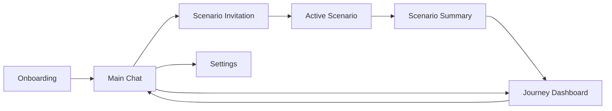
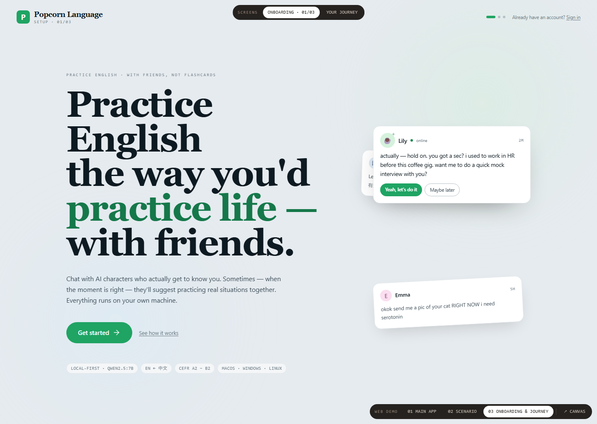
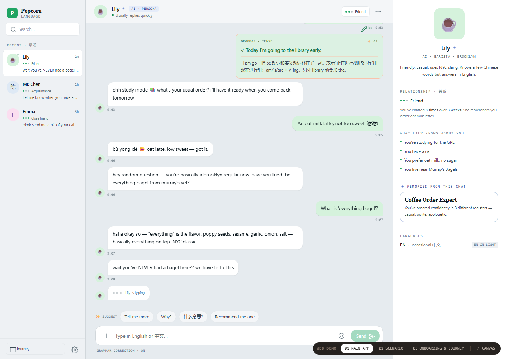
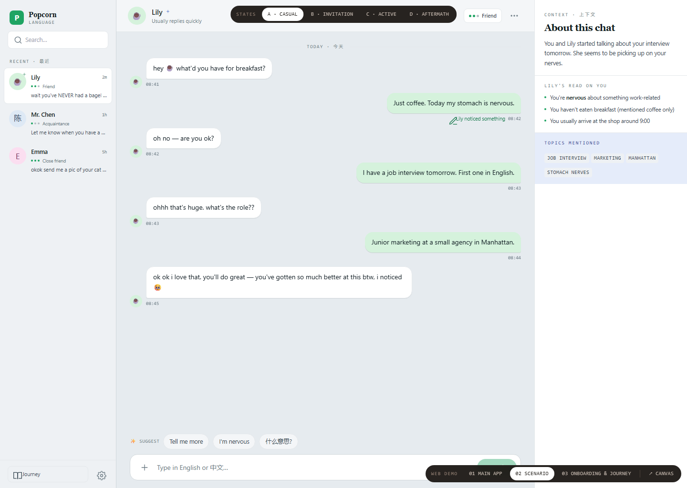
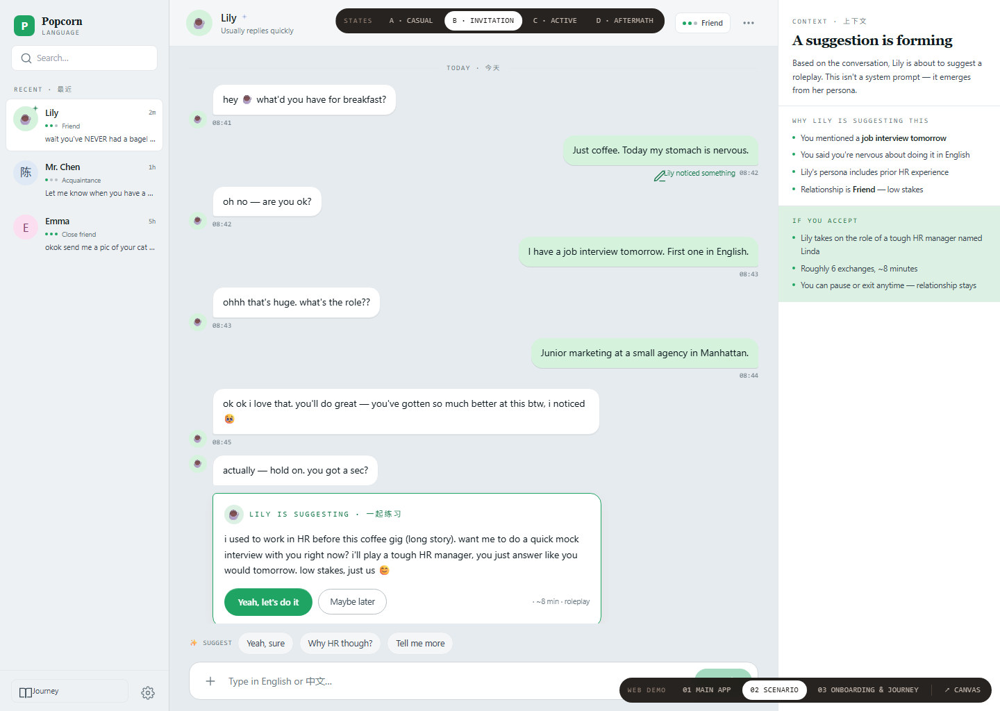
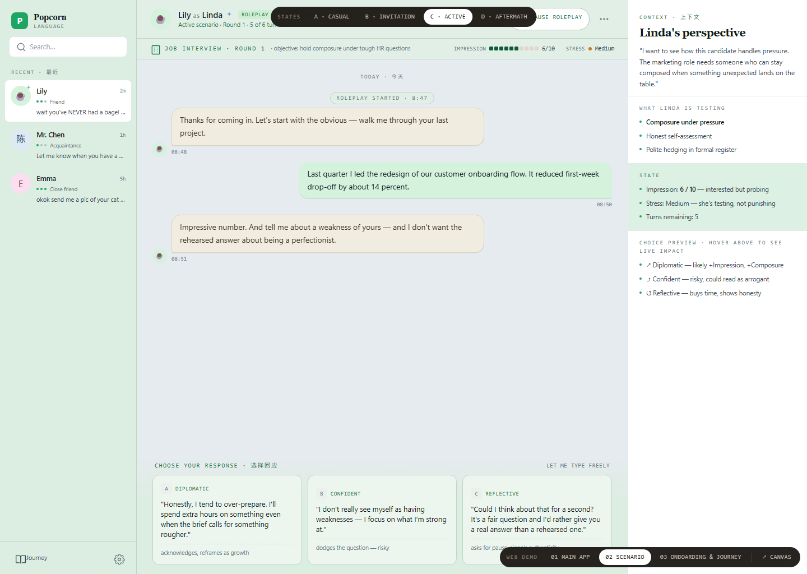
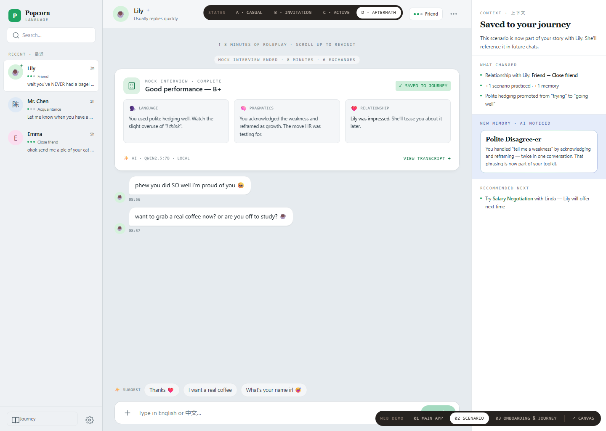
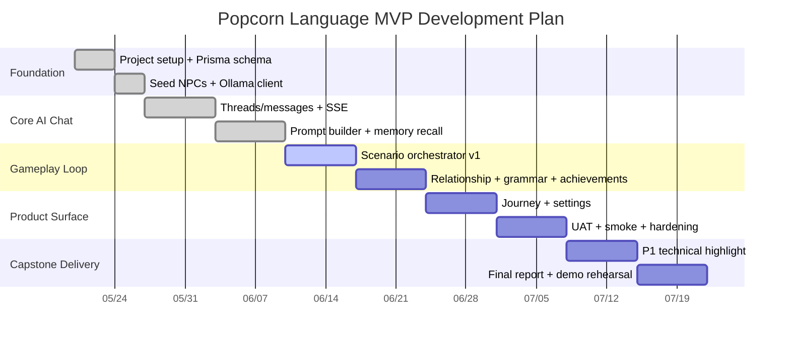
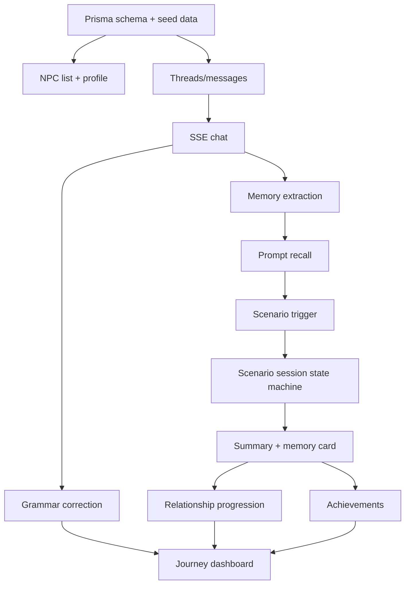

# Popcorn Language 产品立项 PRD

> 版本：v1.0
> 日期：2026-06-04
> 依据：`docs/context.md`、`docs/web-ui-summary.md`、`docs/backend.md`、`docs/uat-sop.md`、`README.md`、`static-prototype/` 静态原型
> 产品定位：基于本地 LLM 的中英双语 AI 语言练习产品，以“持续 NPC 社交关系 + 嵌入式情景事件”驱动练习留存。

---

## 1. 需求背景

### 1.1 项目背景

Popcorn Language 是 NUS MComp Capstone 项目，目标不是商业上线产品，而是一个工程型产品 demo。项目需要展示 AI integration、memory architecture、scenario gameplay、双语交互和用户旅程设计的完整闭环。

原始项目要求包含三个方向：

1. 将 AI 生成能力从 English-centric 扩展到多语言或双语语境。
2. 基于反馈优化整体用户旅程和界面。
3. 通过 achievement/gameplay features 提升 engagement 和 retention。

当前产品方向已经收敛为：**Duolingo-style learning framework + AI 深度集成**，进一步具体化为 **Popcorn Social**。它不是传统题库、背单词或课程流，而是让学习者与 AI NPC 建立持续关系，在日常聊天中自然触发可练习的情景事件。

### 1.2 核心问题

现有 AI 语言学习产品通常有两类问题：

| 问题 | 用户体验表现 | Popcorn Language 的切入点 |
|---|---|---|
| AI 功能像“附加工具” | 解释答案、单次 roleplay、课后反馈与主循环割裂 | 把 AI NPC 作为主交互对象，让练习从关系和对话中自然发生 |
| 云端大模型成本高且不可控 | 个性化越强，API 成本和隐私风险越高 | 使用本地 Ollama 模型，探索 local-first 的个性化架构 |
| 长对话一致性弱 | NPC 容易忘记用户、人格漂移、上下文断裂 | 通过 recent buffer、summary、memory facts、semantic/hybrid recall 组合缓解 |
| 练习场景像做题 | 用户进入 roleplay 时有明显“切出学习任务”的感觉 | 使用嵌入式 scenario，保持同一聊天界面和同一 NPC 连续性 |

### 1.3 产品机会

Popcorn Language 的机会点不是“再做一个 AI tutor”，而是验证一个更具体的产品假设：

> 如果 AI NPC 能记住用户、主动发起练习，并将 scenario 结果沉淀成关系、记忆和成就，那么语言学习可以从“任务驱动”转为“关系驱动”的持续练习体验。

### 1.4 项目目标

**产品目标**

- 让中文母语用户以低压力方式练习英语表达。
- 通过 AI NPC 日常聊天提升练习频率。
- 通过 scenario 事件提供可结构化评估的语言使用场景。
- 通过 Journey、memory、relationship、achievement 形成可见成长闭环。

**工程目标**

- 基于 Next.js 14、TypeScript、Prisma、SQLite、Ollama 构建端到端可运行 demo。
- 实现 SSE streaming chat、memory engine、scenario orchestrator、grammar correction、achievements、settings、UAT 流程。
- 支持在 Ollama 不可用时 graceful degradation，不阻塞非 AI 流程。

---

## 2. 竞品分析

### 2.1 竞品选择

本 PRD 选取三类直接相关竞品：

| 竞品 | 类型 | 选择原因 |
|---|---|---|
| Duolingo Max | 大众化语言学习 + AI 功能 | 代表“传统 gamification + AI feature layer”模式 |
| Langua / LanguaTalk | AI conversation tutor | 代表 AI tutor、roleplay、feedback、memory 的成熟产品方向 |
| TalkPal | AI language tutor / roleplay | 代表多语言 AI tutor、个性化进度和跨端练习方向 |

资料来源：

- [Duolingo Max 官方介绍](https://blog.duolingo.com/duolingo-max/)
- [Duolingo Explain My Answer 免费化公告](https://blog.duolingo.com/explain-my-answer-now-free/)
- [Langua AI language tutor 官方页面](https://languatalk.com/ai-language-tutor)
- [TalkPal AI language tutors 官方页面](https://talkpal.co/)
- [TalkPal roleplays 官方页面](https://talkpal.ai/roleplays/)

### 2.2 对比表

| 维度 | Duolingo Max | Langua / LanguaTalk | TalkPal | Popcorn Language |
|---|---|---|---|---|
| 核心交互 | 课程路径、题目、Video Call、Roleplay | AI tutor 对话、roleplay、反馈、词汇复习 | AI tutor、多语言练习、roleplay | NPC 社交聊天 + 嵌入式 scenario |
| AI 角色定位 | 课程体系中的 AI 增强功能 | AI 教师或 tutor | AI tutor | 关系型 NPC，既是朋友也是练习触发器 |
| 场景触发 | 多由课程路径或功能入口触发 | 用户选择主题或对话 | 用户选择 tutor/roleplay | NPC 基于聊天内容和关系主动邀请 |
| 记忆能力 | Video Call 中 Lily 可记住上次讨论内容 | 官方强调 smart memory 可记住兴趣和关键事实 | 官方强调记住进度、识别弱项、调节难度 | 以 memory engine 为核心工程模块，可切换 recall strategy |
| 部署模式 | 云端专有模型 | 云端 AI 服务 | 云端 AI 服务 | 本地 Ollama + SQLite，local-first |
| 学习闭环 | XP、path、practice hub、反馈 | 对话、反馈、词汇、flashcard | 进度、弱项、难度调节 | 关系升级、scenario summary、AI memory、achievement、Journey |
| 差异化风险 | 功能成熟、品牌强 | AI tutor 体验强 | 多语言覆盖广 | 模型能力和本地延迟受限，需要设计约束 |

### 2.3 竞品启示

1. **AI 对话已经成为语言学习标配**
   Duolingo Max、Langua、TalkPal 都将对话练习作为 AI 能力核心之一，说明市场和用户预期已经从“刷题”转向“可交互练习”。

2. **反馈和纠错是必备能力，不是差异化本身**
   语法解释、翻译、纠错、建议回复在竞品中普遍存在。Popcorn Language 需要把纠错作为基础能力，而不是主卖点。

3. **可持续个性化是关键差异点**
   Langua 和 TalkPal 都强调 memory/progress。Popcorn Language 的差异在于把记忆显式产品化：用户能在 persona panel 和 Journey 中看到 NPC 记住了什么、AI 观察到了什么。

4. **本地 LLM 是工程和产品双重约束**
   本地模型带来隐私、成本和可控性优势，但也带来延迟、JSON 稳定性和长程一致性挑战。因此本产品需要通过 bounded scenario、schema validation、fallback、streaming UI 来“顺着模型能力设计”。

### 2.4 差异化定位

Popcorn Language 的差异化不是“更多语言”或“更强 teacher”，而是：

- **Relationship-first**：学习对象不是题库，而是会记住你的 NPC。
- **Scenario emerges from chat**：练习不是从菜单进入，而是由 NPC 在合适时机自然提出。
- **Local-first AI architecture**：将本地模型限制转化为工程设计主题。
- **Memory as product surface**：记忆不是隐藏算法，而是 Journey 和 persona panel 中可见的成长证据。

---

## 3. 产品原型与核心用户路径

### 3.1 信息架构

### 3.2 核心页面

| 页面 | 目标 | 关键模块 |
|---|---|---|
| Onboarding | 建立产品心智，收集基础 profile | Welcome、role/goal/interests、Meet Lily |
| Main Chat | 日常练习主场 | NPC 列表、聊天流、纠错卡、persona/memory panel |
| Scenario | 从聊天自然进入练习事件 | Invitation、HUD、choice composer、summary |
| Journey | 展示长期成长和沉淀 | relationships、scenarios、memories、achievements |
| Settings | 控制本地模型和体验开关 | grammar correction、memory strategy、model、reset |

### 3.3 用户路径 1：首次进入与 Onboarding

目标：用户理解产品不是 flashcards，而是和 AI friends 练习真实生活英语。

步骤：

1. 用户打开产品，看到主张：“Practice English the way you'd practice life with friends.”
2. 用户理解 local-first、EN/中文、CEFR A2-B2 等范围。
3. 用户进入 profile step，选择身份、学习目标和兴趣。
4. 用户认识第一个 NPC Lily，并看到她可能在聊天中主动提出 scenario。

### 3.4 用户路径 2：日常 NPC 聊天

目标：让用户以社交聊天方式产生高频、低压力英语输出。

步骤：

1. 用户进入 Main Chat，默认打开 Lily。
2. 左侧切换 Lily、Mr. Chen、Emma 三个 NPC。
3. 用户发送中文、英文或中英混合消息。
4. NPC 以 persona 驱动的方式回复，并通过 SSE token streaming 呈现。
5. 系统生成 grammar correction，作为嵌入式卡片出现。
6. 右侧 persona panel 展示 NPC 记住的用户事实和 AI memory。

### 3.5 用户路径 3：NPC 主动触发 Scenario

目标：将练习场景变成聊天关系中的自然延展，而不是“去做一道题”。

步骤：

1. 用户在聊天中透露情境，例如“明天有英语面试”。
2. 系统基于关系等级、对话轮数、topic match、cooldown 判断是否可触发。
3. Lily 以普通消息形式提出 mock interview 邀请。
4. 用户可以接受，也可以稍后再说，保留控制权。

### 3.6 用户路径 4：Scenario 进行中

目标：在 bounded gameplay 中控制本地 LLM 的不稳定性，同时给用户清晰反馈。

步骤：

1. 用户接受邀请后，Lily 切换为 roleplay 角色 Linda。
2. 页面仍保留聊天布局，但背景、header、HUD、输入区发生氛围变化。
3. HUD 展示 impression、stress、turns left 等状态。
4. 用户通过三张 choice cards 选择回答策略，也可自由输入。
5. 每轮 scenario 由 JSON state machine 更新状态，直到结束。

### 3.7 用户路径 5：Scenario 结束与 Journey 沉淀

目标：让一次练习转化为可回顾、可积累、可影响关系的成长记录。

步骤：

1. scenario 结束后生成 summary card。
2. summary 包含 grade、language、pragmatics、relationship 三类反馈。
3. 系统生成新的 AI memory。
4. 关系可能升级，例如 Friend 到 Close friend。
5. Journey dashboard 汇总 relationships、scenarios、memories、achievements。

---

## 4. 功能列表与优先级

优先级定义：

- **P0 必须做**：没有它就无法成立 MVP 或无法支撑核心 demo。
- **P1 应该做**：显著提升产品完整度或技术贡献，但可按时间裁剪。
- **P2 可延后**：适合后续版本或展示加分项。

### 4.1 P0 功能

| 模块 | 功能 | 用户价值 | 验收标准 |
|---|---|---|---|
| Onboarding | 注册/登录、profile 收集、完成引导 | 建立个性化基础 | 新用户可完成 wizard 并进入主应用 |
| NPC 系统 | Lily、Mr. Chen、Emma 三个 NPC | 提供差异化聊天对象 | NPC 列表显示关系等级、最近消息、persona 信息 |
| Chat | 与 NPC 一对一聊天 | 形成主练习场景 | 消息可持久化，NPC 回复可 SSE 流式展示 |
| Grammar Correction | 嵌入式纠错卡 | 降低学习挫败，提高反馈密度 | 错误句子可触发 correction，设置关闭后不展示 |
| Memory Engine | recent、summary、semantic、hybrid recall | 让 NPC 记住用户 | persona panel 和 prompt 可使用记忆事实 |
| Scenario Trigger | NPC 主动邀请 scenario | 让练习从对话自然发生 | 满足规则后生成 invitation，可 accept/decline |
| Scenario Gameplay | accept、choice、freetype、pause、abort、summary | 提供结构化语言使用练习 | scenario 可从 invited 到 completed，全程落库 |
| Relationship | 三档关系和进度 | 增强留存与情感反馈 | 聊天和 scenario 可改变 relationship points/stage |
| Journey | 汇总 relationships、scenarios、memories、streak | 展示长期成长 | Journey 可展示 live data 和历史记录 |
| Achievements | 6 个静态成就 | 游戏化反馈 | First Chat、Scenario Survivor 等可解锁 |
| Settings/System | grammar toggle、model、memory strategy、health、reset | 支撑 demo 和 UAT | 设置可保存，health 可反映 Ollama 状态 |
| UAT | 15 个手动验收用例 | 保证端到端体验 | 核心流程可按 SOP 执行并记录 |

### 4.2 P1 功能

| 模块 | 功能 | 用户价值 | 说明 |
|---|---|---|---|
| Dynamic Achievements | LLM 根据行为生成个性化成就 | 提升独特感和 replay value | 已作为 W8 shipped，可作为技术亮点 |
| Cross-NPC Memory Network | NPC 间传播部分事实 | 增强世界观和关系真实感 | 需要谨慎控制隐私和“过度共享” |
| Reflective Companion | 周期性学习反思报告 | 帮用户理解自己的表达模式 | 可在 Journey 中作为 weekly reflection |
| 第二个 Scenario Template | Salary Negotiation / Coffee Order 等 | 提升内容丰富度 | 至少补一个以验证 template 泛化 |
| Memory Ablation UI | 不同 recall strategy 的可视化比较 | 强化 capstone 技术贡献 | 对导师/评审展示有价值 |

### 4.3 P2 功能

| 模块 | 功能 | 原因 |
|---|---|---|
| Mobile App | iOS/Android 原生端 | 工程量超出单人 capstone |
| Voice/TTS 深度对话 | 语音输入、实时通话、口语评分 | 依赖额外模型和音频链路 |
| Group Chat | 多 NPC 同场对话 | 对 persona consistency 和状态管理要求高 |
| Skill Tree / 排行榜 | 传统学习平台结构 | 与 relationship-first 定位不完全一致 |
| 付费/部署 | 商业化能力 | 当前项目明确为 local demo |

---

## 5. 非功能需求与技术约束

### 5.1 技术栈

| 层级 | 方案 |
|---|---|
| 前后端 | Next.js 14 App Router + TypeScript |
| UI | React 18、静态 web client served same-origin at `/app` |
| 数据库 | SQLite + Prisma |
| LLM | Ollama HTTP API |
| Chat model | `qwen3.5:9b`，早期文档中为 `qwen2.5:7b` |
| Embedding model | `nomic-embed-text` |
| Streaming | REST + SSE |
| 测试 | Vitest、headless smoke、manual UAT |

### 5.2 性能与稳定性

| 需求 | 标准 |
|---|---|
| 启动 | 无 Ollama 时 app 仍可启动，非 AI 页面可用 |
| Chat streaming | 用户消息立即出现，NPC 回复 token-by-token 呈现 |
| 错误恢复 | Ollama 不可达时显示错误状态，composer 重新可用 |
| JSON 稳定性 | scenario state 使用 schema validation、retry、fallback |
| 数据隔离 | 所有业务查询按 `userId` scoped |
| 本地隐私 | 数据保存在本地 SQLite，PRD 范围不考虑云同步 |

### 5.3 明确不做

- 不做移动端。
- 不做生产级 authentication。
- 不做云端部署或商业化支付。
- 不做严肃学习效果对照实验。
- 不做超过 3 个核心 NPC 和超过 2 个 scenario 的 MVP 范围。

---

## 6. 开发计划

### 6.1 里程碑表

| 阶段 | 周期 | 目标 | 主要交付 |
|---|---:|---|---|
| W1 Foundation | 第 1 周 | 项目骨架、DB、seed、Ollama client | Next.js API、Prisma schema、3 NPC seed、health |
| W2 Chat SSE | 第 2 周 | 主聊天跑通 | threads/messages API、SSE stream、chat UI wiring |
| W3 Memory Engine | 第 3 周 | NPC 可记住用户 | recent buffer、summary、facts、recall strategy |
| W4 Scenario v1 | 第 4 周 | Mock Interview 全流程 | trigger、invitation、accept、choices、summary |
| W5 Progression | 第 5 周 | 关系/纠错/成就闭环 | relationship、grammar correction、static achievements |
| W6 Journey & Settings | 第 6 周 | 产品闭环展示 | Journey dashboard、settings、system reset |
| W7 Hardening | 第 7 周 | 稳定性和 UAT | error handling、offline Ollama、smoke:web、UAT SOP |
| W8 P1 Highlight | 第 8 周 | 技术亮点补强 | dynamic achievements 或 memory ablation report |
| W9 Report & Demo | 第 9 周 | 演示材料 | final report figures、demo script、known issues |

### 6.2 甘特图

### 6.3 开发依赖关系

---

## 7. 验收标准

### 7.1 MVP 验收

MVP 可接受条件：

- 用户可完成 onboarding 或登录 demo account。
- 用户可进入 main chat，与至少 3 个 NPC 中任意一个聊天。
- 聊天消息持久化，刷新后仍可加载。
- AI 回复可通过 SSE 流式显示。
- grammar correction 可出现、可通过 settings 关闭。
- 至少 1 个 scenario 可从 invitation 到 completed。
- scenario 结束后生成 summary，并进入 Journey。
- Journey 显示 relationships、scenarios、memories、achievements。
- Ollama 不可用时，系统不崩溃，非 AI 流程可继续使用。
- UAT SOP 中 P0 核心用例无 Critical/High defect。

### 7.2 指标建议

| 指标 | 类型 | 目标 |
|---|---|---|
| First chat completion | 激活 | 新用户完成 onboarding 后发送首条消息 |
| Scenario accept rate | engagement | 被邀请后选择 accept 的比例 |
| Scenario completion rate | gameplay | accept 后完成 scenario 的比例 |
| Memory visibility | 信任 | 用户是否能在 Journey/persona panel 看到记忆沉淀 |
| Retry after error | 稳定性 | Ollama 错误后 composer 是否恢复 |
| 7-day streak | retention proxy | demo 中用于展示长期练习闭环 |

---

## 8. 风险与应对

| 风险 | 影响 | 应对 |
|---|---|---|
| 本地模型响应慢 | 用户等待焦虑 | SSE streaming、typing indicator、短 prompt、异步纠错 |
| JSON 输出不稳定 | scenario 状态机失败 | Ollama `format: "json"`、Zod schema、retry、fallback |
| NPC 人格漂移 | 社交真实感下降 | persona prompt、memory recall、recent buffer、summary |
| 记忆召回不准 | 用户感觉“被错误记住” | memory confidence、可删除 memory、recall strategy ablation |
| scenario 触发突兀 | 像系统弹窗，破坏关系感 | 由 NPC 消息发起，展示 trigger rationale，允许 decline |
| scope 膨胀 | 单人开发超时 | P0 限定 3 NPC、1-2 scenario、web only |

---

## 9. 立项结论

建议立项并以 **Web-based AI core + embedded gameplay** 作为 MVP 主线。

本产品相对竞品的立项价值在于：它不把 AI 当作传统学习流程的补丁，而是把 AI NPC、记忆、关系、scenario 和 Journey 设计成同一个闭环。工程上，本地 LLM 的限制不是副作用，而是项目的技术贡献来源：通过 memory architecture、bounded scenario state machine、streaming UI 和 graceful degradation 来验证 local-first AI language learning 的可行性。

MVP 成功的判断不应是“语言学习效果显著提升”，而是：

1. 用户能否持续和 NPC 对话。
2. scenario 能否自然从聊天中出现并完成。
3. 记忆、关系、成就是否让一次次练习沉淀为可见旅程。
4. 本地 LLM 架构是否能在可控范围内支撑端到端体验。
